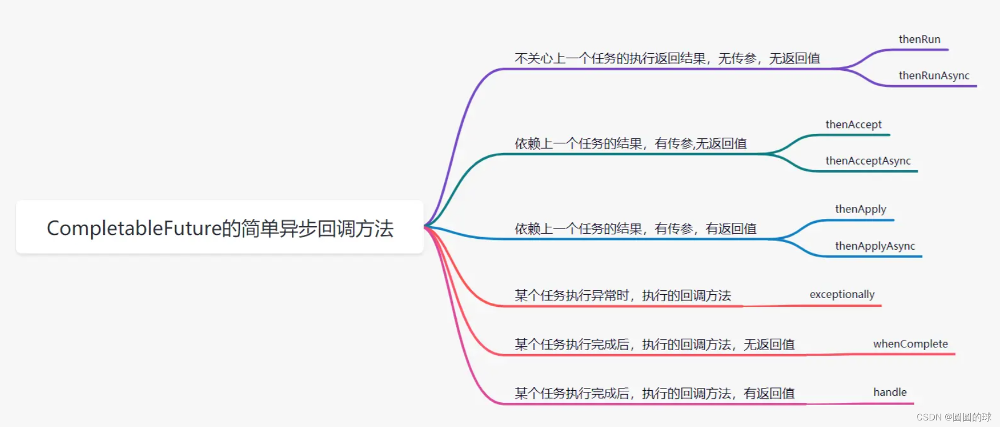
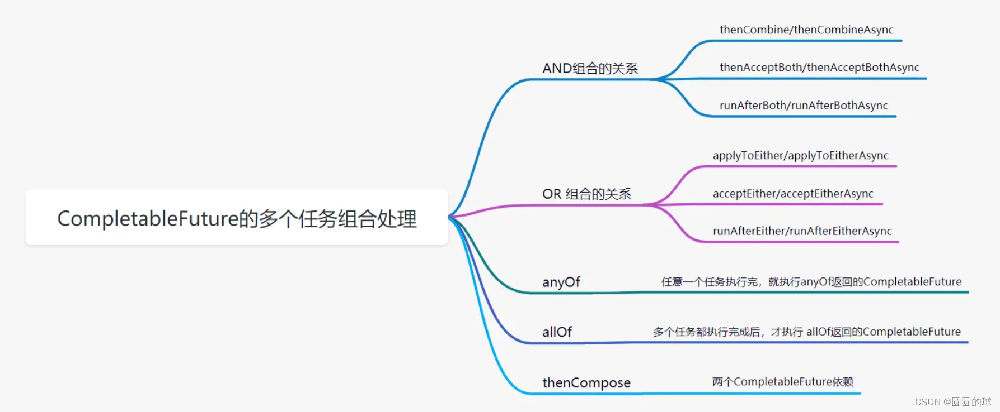

### 请简要描述线程与进程的关系,区别及优缺点？

一个进程中可以有多个线程，多个线程共享进程的**堆**和**方法区 (JDK1.8 之后的元空间)资源，但是每个线程有自己的程序计数器、虚拟机栈 和 本地方法栈**。

总结来说就是**线程是进程划分成的更小的运行单位。线程和进程最大的不同在于基本上各进程是独立的，而各线程则不一定，因为同一进程中的线程极有可能会相互影响。线程执行开销小，但不利于资源的管理和保护；而进程正相反**

### 堆和方法区的区别

堆和方法区是所有线程共享的资源，其中堆是进程中最大的一块内存，主要用于存放新创建的对象 (几乎所有对象都在这里分配内存)，方法区主要用于存放已被加载的类信息、常量、静态变量、即时编译器编译后的代码等数据。

### 使用多线程可能带来的问题

并行的目的是为了能够提高程序的执行效率提升运行速度。 但并发编程可能会带来几点问题：内存泄漏、死锁、线程不安全等等

### 什么是线程不安全

线程不安全指的是 在多线程环境下，对同一份数据，多个线程同时访问可能会造成数据混乱、错误、丢失等问题。

### 线程的状态

1. 初始状态
2. 运行状态
3. 阻塞状态
4. 等待状态
5. 超时等待状态
6. 终止状态

### 什么是线程死锁，如何避免

多个线程同时阻塞，他们中的一个或多个都在等待某个资源被释放。由于线程被无限期地阻塞，因此程序不可能正常终止。

1. 互斥条件
2. 请求与保持条件
3. 不剥夺条件
4. 循环等待条件

避免的方法就是借助于算法（比如银行家算法）对资源分配进行计算评估，使其进入安全状态。

### 什么是线程上下文切换

线程在执行的过程中也会有自己的运行条件和状态（上下文）。线程切换意味着需要保存当前线程的上下文，留待线程下次占用 CPU 的时候恢复现场。并加载下一个将要占用 CPU 的线程上下文。

 发生线程上下文切换有三种情况

1. 主动让出CPU，即调用了`sleep`和`wait`
2. 时间片用完了
3. 调用了阻塞类型的系统中断，比如请求 IO，线程被阻塞。

### sleep（）和wait（）的区别

1. sleep 没有释放锁而wait释放了锁

2. sleep通常用于暂停执行，wait被用于线程间的交互

3. wait被调用后不会自动苏醒，需要调用notify来唤醒。 sleep到某个时间后就会苏醒

   

### 可以直接调用Thread类的run方法吗

**调用 `start()` 方法方可启动线程并使线程进入就绪状态，直接执行 `run()` 方法的话不会以多线程的方式执行。**

### JUC包下常见的类

1. ReentrantLock：可重入锁

2. Semaphore：信号量

3. CountDownLatch：计数器

4. CyclicBarrier：循环屏障

5. Atomic：原子类

   

## Atomic原子类

 Atomic 是指一个操作是不可中断的。即使是在多个线程一起执行的时候，一个操作一旦开始，就不会被其他线程干扰。原子类说简单点就是具有原子/原子操作特征的类。

使用Atomic的优势是：使用AtomicInteger之后，不需要加锁，也可以实现线程安全

### AtomicInteger线程安全的原理

`AtomicInteger` 类主要利用 CAS (compare and swap) + volatile 和 native 方法来保证原子操作，从而避免 synchronized 的高开销，执行效率大为提升。

CAS 的原理是拿期望的值和原本的一个值作比较，如果相同则更新成新的值。UnSafe 类的 `objectFieldOffset()` 方法是一个本地方法，这个方法是用来拿到“原来的值”的内存地址。另外 value 是一个 volatile 变量，在内存中可见，因此 JVM 可以保证任何时刻任何线程总能拿到该变量的最新值。

### 基本类型院子类：

1. AtomicInteger
2. AtomicLong
3. AtomicBoolean

`AtomicInteger` 类主要利用 CAS (compare and swap) + volatile 和 native 方法来保证原子操作，从而避免 synchronized 的高开销，执行效率大为提升。

### 数组类型原子类

与上类似

### 引用类型原子类

基本类型原子类只能更新一个变量，如果需要原子更新多个变量，需要使用 引用类型原子类。

- AtomicReference: 引用类型原子类
- AtomicStampedReference：原子更新带有版本号的引用类型
- AtomicMarkedReference:  原子更新带有标记的引用类型

## JMM  即 java内存模型

### CPU缓存模型

CPU 缓存则是为了解决 CPU 处理速度和内存处理速度不对等的问题。

1. CPU Cache 缓存的是内存数据用于解决 CPU 处理速度和内存不匹配的问题
2. 内存缓存的是硬盘数据用于解决硬盘访问速度过慢的问题。

**CPU Cache主要分为三层：**

由于在多线程下，CPU Cache的工作方式可能会出错，因此**CPU 为了解决内存缓存不一致性问题可以通过制定缓存一致协议（比如 MESI 协议）或者其他手段来解决。**

### 指令重排序

指令重排序的意思是：简单来说就是系统在执行代码的时候并不一定是按照你写的代码的顺序依次执行。

重排的可能性有：

1. 编译器优化重排
2. 指令并行重排

### JMM

为什么需要JMM

1. Java 语言是跨平台的，它需要自己提供一套内存模型以屏蔽系统差异。换另一个操作系统可能就不行了
2. 规定了从 Java 源代码到 CPU 可执行指令的这个转化过程要遵守哪些和并发相关的原则和规范，其主要目的是为了简化多线程编程，增强程序可移植性的。因为像指令重排、CPU多级缓存这些东西在程序运行过程中可能会出错。

**JMM 是如何抽象线程和主内存之间的关系？**

JMM规定了线程之间的共享变量必须存储在主内存中。

1. 主内存：所有线程创建的实例对象必须存放在主内存中。
2. 本地内存：每个线程都有一个私有的本地内存来存储共享变量的副本。

线程 1 与线程 2 之间如果要进行通信的话，必须要经历下面 2 个步骤：

1. 线程 1 把本地内存中修改过的共享变量副本的值同步到主内存中去。
2. 线程 2 到主存中读取对应的共享变量的值。

也就是说，JMM 为共享变量提供了可见性的保障。

**Java内存区域和JMM有何区别**

1. Java内存区域规定了JVM在运行时如何分区存储程序数据。
2. JMM主要规定了线程和主内存之间的关系。目的是为了简化多线程编程，增强程序可移植性的

**happens-before原则是什么**

**设计思想：**

为了对编译器和处理器的约束尽可能少，只要不改变程序的执行结果（单线程程序和正确执行的多线程程序），编译器和处理器怎么进行重排序优化都行。

对于会改变程序执行结果的重排序，JMM 要求编译器和处理器必须禁止这种重排序。

happens-before是用来描述两个操作之间的内存可见性。**更准确地来说，它更想表达的意义是前一个操作的结果对于后一个操作是可见的，无论这两个操作是否在同一个线程里。**

**如何保证并发编程的三个性质：**

1. 原子性： 借助synchronized、lock和原子类实现（CAS或是volatile或者final关键字）。
2. 可见性：可以借助`synchronized`、`volatile` 以及各种 `Lock` 实现可见性。
3. 有序性：在 Java 中，`volatile` 关键字可以禁止指令进行重排序优化

## Volatile关键字

volatile是用来保证变量的可用性。用来指示 编译器，这个变量是共享且不稳定的，每次使用它都到主存中进行读取。

`volatile` 关键字能保证数据的可见性，但不能保证数据的原子性。`synchronized` 关键字两者都能保证。（一定要记住啊）

volatile不保证原子性可以用三种方法来弥补

1. synchronize
2. atomicInteger
3. reentrantLock

### 禁止指令重排序

如果我们将变量声明为 **`volatile`** ，在对这个变量进行读写操作的时候，会通过插入特定的 **内存屏障** 的方式来禁止指令重排序。（用unsafe也可以）

### 用双重校验锁实现单例模式的原理

我们在new一个实例`uniqueInstance`的时候，主要是分三步来执行：

1. 为`uniqueInstance`分配内存空间
2. 初始化`uniqueInstance`
3. 将`uniqueInstance`指向分配的内存地址。

但是JVM具有指令重排的特征，顺序可能变成1-3-2。但是在多线程环境会出问题。

### 可见性定义：

当一个线程修改了共享变量的值，其他线程能够看到修改的值。

## 乐观锁和悲观锁

乐观锁是什么，悲观锁是什么?

乐观锁总是假设最好的情况，认为共享资源每次被访问的时候不会出现问题，线程可以不停地执行，无需加锁也无需等待，只是在提交修改的时候去验证对应的资源（也就是数据）是否被其它线程修改了。

### 如何实现乐观锁

- 版本号机制
- CAS算法

### 乐观锁存在的问题

- ABA问题:ABA 问题的解决思路是在变量前面追加上**版本号或者时间戳**。

- 循环时间长开销大:CAS 经常会用到自旋操作来进行重试，也就是不成功就一直循环执行直到成功。如果长时间不成功，会给 CPU 带来非常大的执行开销。

- 只能对一个共享变量进行原子性操作:之后就可以通过AtomicReference类来实现多个变量放在一个对象里边进行CAS操作。

## synchronized

### synchronized是什么，主要解决的是什么问题

`synchronized` 是 Java 中的一个关键字，翻译成中文是同步的意思，主要解决的是多个线程之间访问资源的同步性，可以保证被它修饰的方法或者代码块在任意时刻只能有一个线程执行。

### 如何使用synchronized

- 修饰方法类
- 修饰静态方法
- 修饰代码块
- 注意！ 构造方法不能够用synchronized

### synchronized的底层是怎么实现的

属于JVM层面，`synchronized` 同步语句块的实现使用的是 `monitorenter` 和 `monitorexit` 指令，其中 `monitorenter` 指令指向同步代码块的开始位置，`monitorexit` 指令则指明同步代码块的结束位置。当执行 `monitorenter` 指令时，线程试图获取锁也就是获取 **对象监视器 `monitor`** 的持有权。

- monitorenter
- monitorexit
- 程序计数器
- synchronized修饰的方法使用的是ACC_synchronized
- 对象监视器monitor

但是当synchronized修饰的是方法的时候，就没有以上的东西，取而代之的是取得代之的确实是 `ACC_SYNCHRONIZED` 标识，该标识指明了该方法是一个同步方法。JVM 通过该 `ACC_SYNCHRONIZED` 访问标志来辨别一个方法是否声明为同步方法，从而执行相应的同步调用。

不过二者的本质都是对对象监视器monitor获取

### synchronized底层的优化了解吗

在JDK1.6后引入了大量的优化锁

### synchronized和volatile的区别

二者是互补的

1. volatile只能作用在变量上，而synchronized可以修饰方法和代码块。
2. `volatile` 关键字能保证数据的可见性，但不能保证数据的原子性。`synchronized` 关键字两者都能保证。
3. `volatile`关键字主要用于解决变量在多个线程之间的可见性，而 `synchronized` 关键字解决的是多个线程之间访问资源的同步性。

### 为什么说Synchronized保证了可见性？

具体来说，当一个线程进入到synchronized代码块时，它会通过获取锁来保证在同一时间只有它一个线程能够执行关键代码段。同时，当线程获取锁时，它会将本地内存中的所有修改刷新到主内存中，从而保证其他线程能够看到共享数据的最新值。同样，当线程释放锁时，它会将本地内存中的修改刷新到主内存中，从而使其他线程能够看到更新后的共享数据。

因此，synchronized关键字保证了线程之间的同步以及共享数据的可见性。

##  ReentrantLock

### ReentrantLock是什么

是一个可重入且独占式的锁，和 `synchronized` 关键字类似。增加了轮询、超时、中断、公平锁和非公平锁等高级功能。

ReentrantLock底层是由AQS来实现的。

### 公平锁和非公平锁的区别

**公平锁** : 锁被释放之后，先申请的线程先得到锁。性能较差一些，因为公平锁为了保证时间上的绝对顺序，上下文切换更频繁。

**非公平锁**：锁被释放之后，后申请的线程可能会先获取到锁，是随机或者按照其他优先级排序的。性能更好，但可能会导致某些线程永远无法获取到锁。

### synchronized和ReentrontLock的区别

两个都是可重入锁，指的是线程可以再次获取自己的内部锁

**等待可中断** : `ReentrantLock`提供了一种能够中断等待锁的线程的机制。也就是说正在等待的线程可以选择放弃等待，改为处理其他事情。

**可实现公平锁** : `ReentrantLock`可以指定是公平锁还是非公平锁。而`synchronized`只能是非公平锁。所谓的公平锁就是先等待的线程先获得锁。`ReentrantLock`默认情况是非公平的，可以通过 `ReentrantLock`类的`ReentrantLock(boolean fair)`构造方法来制定是否是公平的。

**可实现选择性通知（锁可以绑定多个条件）**: `synchronized`关键字与`wait()`和`notify()`/`notifyAll()`方法相结合可以实现等待/通知机制。`ReentrantLock`类当然也可以实现，但是需要借助于`Condition`接口与`newCondition()`方法。

## ThreadLoacal

创建的变量是可以被任何一个线程访问并修改的。如果想实现每一个线程都有自己的专属本地变量的话就要使用ThreadLocal

### ThreadLocal的作用

那么访问这个变量的每个线程都会有这个变量的本地副本，这也是`ThreadLocal`变量名的由来。他们可以使用 `get()` 和 `set()` 方法来获取默认值或将其值更改为当前线程所存的副本的值，从而避免了线程安全问题。

### ThreadLocal的原理是什么

**最终的变量是放在了当前线程的 `ThreadLocalMap` 中，并不是存在 `ThreadLocal` 上，`ThreadLocal` 可以理解为只是`ThreadLocalMap`的封装，传递了变量值。**

### ThreadLocal和TreadLocalMap的区别

我们在同一个线程中声明了两个 `ThreadLocal` 对象的话， `Thread`内部都是使用仅有的那个`ThreadLocalMap` 存放数据的，`ThreadLocalMap`的 key 就是 `ThreadLocal`对象，value 就是 `ThreadLocal` 对象调用`set`方法设置的值。

### ThreadLocal的内存泄露

`ThreadLocalMap` 中使用的 key 为 `ThreadLocal` 的弱引用，而 value 是强引用。所以，如果 `ThreadLocal` 没有被外部强引用的情况下，在垃圾回收的时候，key 会被清理掉，而 value 不会被清理掉。

`ThreadLocalMap` 实现中已经考虑了这种情况，在调用 `set()`、`get()`、`remove()` 方法的时候，会清理掉 key 为 null 的记录。

## 线程池

线程池、数据库连接池、Http 连接池等等都是对这个思想的应用。池化技术的思想主要是为了减少每次获取资源的消耗，提高对资源的利用率。

### 常见的内置线程池

1. FixedThreadPool：可重用固定线程数的线程池，利用的是无界队列，但并不建议使用FixedThreadPool，因为运行中的 `FixedThreadPool`（未执行 `shutdown()`或 `shutdownNow()`）不会拒绝任务，在任务比较多的时候会导致 OOM（内存溢出）。
2. SingleThreadExecutor：是只有一个线程的线程池。利用的是无界队列，但是只能一个一个获取。但不建议使用，因为和FixedThreadPool一样的问题。
3. CachedThreadPool：是一个会根据需要创建新线程的线程池。但不建议使用，因为如果主线程提交任务的速度高于 `maximumPool` 中线程处理任务的速度时，`CachedThreadPool` 会不断创建新的线程。极端情况下，这样会导致耗尽 cpu 和内存资源。
4. `ScheduledThreadPool`: 使用的是无界的延迟阻塞队列，可能堆积大量的请求，从而导致OOM

### 如何创建线程池

1. 通过 ThreadPoolExecutor构造函数来构建。
2. Executor框架类的`executors`来创建，并且可以创建多种类型的线程

### 阿里巴巴手册中为什么不允许使用内置的线程池

强制线程池不允许使用 `Executors` 去创建，而是通过 `ThreadPoolExecutor` 构造函数的方式

### 线程池常见主要参数

最重要的三个参数，必须要记住的：

1. CorePoolSize:任务队列未达到队列容量时，最大可以同时运行的线程数量。
2. **`maximumPoolSize`** : 务队列中存放的任务达到队列容量的时候，当前可以同时运行的线程数量变为最大线程数。
3. **`workQueue`:** 新任务来的时候会先判断当前运行的线程数量是否达到核心线程数，如果达到的话，新任务就会被存放在队列中。

其他参数：

4. `keepAliveTime：` 如果当前线程数数量大于corepoolsize，如果没有新的任务提交，那么核心线程外的线程不会立即消除，而是等待时间超过KeepAliveTime，之后销毁。
5. `unit`： KeepAliveTime参数的时间单位
6. `handler` 饱和策略。

### 线程池的饱和策略有哪些

当前同时运行的线程数量达到最大线程数量并且队列也已经被放满了任务时，就会制定策略：

1. abortpolicy：直接抛出异常拒绝新任务处理。
2. CallerRunsPolicy： "该策略既不会抛弃任务，也不会抛出异常，而是将任务回推到调用者。"顾名思义，在饱和的情况下，调用者会执行该任务。
3. DiscardPolicy：不处理新任务，直接丢弃。
4. DiscardOldestPolicy: 将丢弃最早未处理的任务请求。

### 线程池常见的阻塞队列

1. `LinkedBlockingQueue`（无界队列）：`FixedThreadPool` 和 `SingleThreadExector` 。由于队列永远不会被放满，因此`FixedThreadPool`最多只能创建核心线程数的线程。
2. `SynchronousQueue`： `SynchronousQueue` 没有容量，不存储元素，目的是保证对于提交的任务，如果有空闲线程，则使用空闲线程来处理；否则新建一个线程来处理任务。可以理解为线程数是可以无限扩展的，可能会创建大量线程，从而导致 OOM
3. `DelayedWorkQueue`：会按照延迟的时间长短对任务进行排序，内部采用的是“堆”的数据结构，可以保证每次出队的任务都是当前队列中执行时间最靠前的。

### 线程池原理分析（重要）

Java中的线程池核心实现类是ThreadPoolExecutor，ThreadPoolExecutor实现的顶层接口是Executor，顶层接口Executor提供了一种思想：将任务提交和任务执行进行解耦。用户无需关注如何创建线程，如何调度线程来执行任务，用户只需提供Runnable对象，将任务的运行逻辑提交到执行器(Executor)中，由Executor框架完成线程的调配和任务的执行部分。

在这个方法中，运行的流程是这样子的：

1. 查看任务是否为Null，如果是则抛出异常。
2. 获取线程池中保存的状态信息
3. 判断当前线程池中执行的任务数量是否小于CorePoreSize。
   - 如果小于，则通过addWorker（command，true）创建一个新的线程，并将这个任务添加到线程中，启动并执行。
   - 如果大于并且小于最大线程数，表明创建新的线程失败。通过 isRunning 方法判断线程池状态，线程池处于 RUNNING 状态并且阻塞队列可以加入任务，该任务才会被加入进去等待执行。
   - 如果向任务队列投放任务失败（任务队列已经满了），但是当前运行的线程数是小于最大线程数的，就新建一个线程来执行任务。
   - 如果当前运行的线程数已经等同于最大线程数了，新建线程将会使当前运行的线程超出最大线程数，那么当前任务会被拒绝。

### 常见的对比

1. Runnable & Callable
   - Runnable接口不会返回结果或抛出异常
   - Callable会
2. execute（） &  submit（）
   - execute（） 用于提交不需要返回值的任务，所以无法判断任务是否被线程池执行成功与否。
   - 方法用于提交需要返回值的任务。线程池会返回一个 `Future` 类型的对象，通过这个 `Future` 对象可以判断任务是否执行成功。（Future.get（））
3. shutdown（） &  shutdownNow()
   - 前者是 关闭线程池不再接受新的线程任务了，但是已经执行的会执行下去。
   - 后者是全部停止，正在执行的会停止并返回正在等待执行的List中
4. isTerminated()   &   isShutDown（）
   - 前者 调用shutdown() 方法后会返回true
   - 后者 调用 shutdown（） 方法后，等全部提交的任务完成后才会返回true

### Java并发常见的容器

**CurrentHashMap**

HashMap线程不安全，在并发情况下需要用SynchronizedMap来包装HashMap，会带来性能问题。

**CopyOnWriteArrayList**

在很多应用场景中，读操作可能会远远大于写操作。由于读操作根本不会修改原有的数据，因此对于每次读取都进行加锁其实是一种资源浪费。我们应该允许多个线程同时访问 `List` 的内部数据，毕竟读取操作是安全的。

`CopyOnWriteArrayList`   读取不需要加锁，写入也不会读取操作，实际操作就是  要修改的时候，我不在原有数据上进行修改，而是复制一份，然后修改完后再覆盖。  用计算机术语来说就是：在计算机，如果你想要对一块内存进行修改时，我们不在原有内存块中进行写操作，而是将内存拷贝一份，在新的内存中进行写操作，写完之后呢，就将指向原来内存指针指向新的内存，原来的内存就可以被回收掉了。

## Future

### Future类的作用

异步调用，主要用于多线程领域上，我有一个任务，提交给了 `Future` 来处理。任务执行期间我自己可以去做任何想做的事情。并且，在这期间我还可以取消任务以及获取任务的执行状态。一段时间之后，我就可以 `Future` 那里直接取出任务执行结果。

### Callable 和 Future的区别

`FutureTask` 提供了 `Future` 接口的基本实现，常用来封装 `Callable` 和 `Runnable`，具有取消任务、查看任务是否执行完成以及获取任务执行结果的方法

### CompletableFuture的作用是什么

`CompletableFuture` 同时实现了 `Future` 和 `CompletionStage` 接口。（原理）

Future 在实际使用过程中存在有局限性

1. 异步任务的编排组合。
2. 获取计算结果为阻塞调用。
3. 多任务组合处理

也就是说Future在应对一些简单且相互独立的异步执行场景很便捷，但是在一些复杂的场景，比如同时需要多个有依赖关系的异步独立处理的时候，或者是一些类似流水线的异步处理场景时，就显得力不从心了。比如说

1. 同时执行多个并行任务，等待最快的一个完成之后就可以继续往后处理
2. 多个异步任务，每个异步任务都需要依赖前一个异步任务执行的结果再去执行下一个异步任务，最后只需要一个最终的结果
3. 等待多个异步任务全部执行完成后触发下一个动作执行

### SupplyAsync 和 runAsync的区别：

前者允许执行函数有返回值T，后者传入的是`Callable` 类型，仅仅执行，不返回。

### 为什么说CompletableFuture在多个异步任务中有优势

completableFuture有多种提供选择的异步执行方法

1. thenApply：对CompletableFuture的执行后的具体结果进行追加处理，并将当前的CompletableFuture泛型对象更改为处理后新的对象类型，返回当前CompletableFuture对象。
2. thenCompose：与thenApply类似。区别点在于：此方法的入参函数返回一个CompletableFuture类型对象。
3. thenAccept：thenAccept返回void类型，没有具体结果输出，适合无需返回值的场景。
4. thenRun：与thenAccept类似，thenAccept可以将前面CompletableFuture执行的实际结果作为入参进行传入并使用，但是thenRun方法没有任何入参，只能执行一个Runnable函数，并且返回void类型

上面指的是流水线的处理场景，实际还有很多流水线处理场景也不会是一个链路顺序往下走的情况，很多时候为了提升并行效率，一些没有依赖的环节我们会让他们同时去执行，然后在某些环节需要依赖的时候，进行结果的依赖合并处理。 CompletableFuture解决了这些难点。

具体的使用方法可以是：

1. 任务回调：

   

​	2. 任务编排

​	

`thenCombine` / `thenAcceptBoth` / `runAfterBoth`都表示：**将两个`CompletableFuture`组合起来，只有这两个都正常执行完了，才会执行某个任务**。

### CompletableFuture的Get() 和 Join()的区别

1. Get() 会等待CompletableFuture执行完成并获取其具体执行结果，可能会抛出异常，需要代码调用的地方手动try...catch进行处理。
2. join() 等待CompletableFuture执行完成并获取其具体执行结果，可能会抛出运行时异常，无需代码调用的地方手动try...catch进行处理。

## AQS

### AQS是什么，核心思想和原理是什么

名称叫抽象队列同步器，这个类在 `java.util.concurrent.locks` 包下面。AQS是一个抽象类，主要是用来构建锁和同步器的。

它的作用就是：

1. 如果被请求的共享资源空闲，那么请求这个资源的线程就会被设置有有效的工作线程，并将资源设置为锁定状态。

2. 如果被请求的共享资源被占用，那么就需要线程阻塞等待以及被唤醒时锁分配的机制，这个机制就是CLH队列锁。

3. CLH队列锁的作用就是将暂时获取不到锁的线程加入到队列中。

   

CLH是一个虚拟的双向队列（虚拟指的是就是不存在队列实体，仅仅是结点之间的关联关系）。AQS 是将每条请求共享资源的线程封装成一个 CLH 锁队列的一个结点，来实现锁的分配。

CLH是用一个int成员变量来表示同步状态state，通过内置的线程等待队列来完成获取资源线程的排队工作。

- 以`ReentrantLock`为例，state的初始值为0，表示为锁定状态，当线程请求后，state就会+1，其他线程就无法请求。 由于ReentrantLock是可重入锁，state可以一直累加，直到 A 线程 `unlock()` 到 `state=`0（即释放锁）为止，其它线程才有机会获取该锁。
- `CountDownLock`同理，分成N个子线程执行，state也会变成N，每次结束后state-1，直到state为0才会介绍调用

### AQS资源共享方法

AQS有两种资源共享方法，即独占和共享。

### Semaphore是什么

`synchronized` 和 `ReentrantLock` 都是一次只允许一个线程访问某个资源，而`Semaphore`(信号量)可以用来控制同时访问特定资源的线程数量。比如设置为5，则代表只有5个线程可以获得共享资源。

**Semaphore** 有两种模式，

1. 公平模式：遵循先到先得
2. 非公平模式：抢占式

`Semaphore` 通常用于那些资源有明确访问数量限制的场景比如限流（仅限于单机模式，实际项目中推荐使用 Redis +Lua 来做限流）

### Semaphore的原理是什么

`Semaphore`是共享锁的一种实现，它默认构造 AQS 的 `state` 值为 `permits`，可以将 `permits` 的值理解为许可证的数量，只有拿到许可证的线程才能执行。

1. 调用semaphore.acquire()，获取许可证，如果`state >= 0`，如果获取成功的话，就使用CAS操作去修改`state`的值。  如果`state < 0` ，则表示许可证数量不足，创建一个Node节点加入阻塞队列，挂起线程。
2. semaphore.release() 代表的是释放许可证。

### CountDownLatch的作用，它的原理是什么

运行`Count`个线程阻塞在同一个地方，直到所有的线程的任务完成结束。注意，CountDownLatch是一次性的。

`countdownlatch`是共享锁的体现，将AQS的state设置为count。

1. 调用coutdown的时候，就会以cas的操作减少state，直至state为0.
2. 调用await的时候，如果state不为0，就代表任务还没完成，await就会一直阻塞。
3. 然后，`CountDownLatch` 会自旋 CAS 判断 `state == 0`，如果 `state == 0` 的话，就会释放所有等待的线程，`await()` 方法之后的语句得到执行。

### CountDownLatch应用场景都有哪些，可以使用CompletableFuture吗？

`CountDownLatch` 的作用就是 允许 count 个线程阻塞在一个地方，直至所有线程的任务都执行完毕。

## Cyclicbarrier

循环屏障，它可以协同多个线程，让多个线程在这个屏障前等到，直到所有线程都到达了这个屏障时，再一起执行后面的操作。假如每个线程各有一个await，任何一个线程运行到await方法时就阻塞，直到最后一个线程运行到await时才同时返回

### 与 CountDownLatch的区别

1 、 CyclicBarrier 的某个线程运行到某个点上之后，该线程即停止运行，直到所有的线程都到达了这个点，所有线程才重新运行； CountDownLatch 则不是，某线程运行到某个点上之后，只是给某个数值 -1 而已，该线程继续运行
2 、 CyclicBarrier 以唤起多个线程， CountDownLatch 可只能唤起一个线程
3 、 CyclicBarrier 可重用， CountDownLatch 不可重用，计数值为 0 该 CountDownLatch 就不可再用了

### 内部原理

1. CyclicBarrier内部通过一个count变量作为计数器，每当一个线程到达某个点的时候，也就是栅栏，计数器就会减1，如果count为0，那么这个栅栏就会打开。
2. 当每个线程都调用1次 `await`，就代表这个线程到达了这个栅栏，当前线程被阻塞。
3. 当拦住的线程数量达到 `count` 的值时，栅栏才会打开，线程才得以通过执行。

## ThreadLocalMap

ThreadLocal的底层结构： 数组。具体来说就是

1. `Thread`类有一个类型为`ThreadLocal.ThreadLocalMap`的实例变量`threadLocals`，也就是说每个线程有一个自己的`ThreadLocalMap`。
2. key为线程的ThreadLocal，value就是放入的值。
3. **如何保证线程隔离？**每个线程在往`ThreadLocal`里放值的时候，都会往自己的`ThreadLocalMap`里存，读也是以`ThreadLocal`作为引用，在自己的`map`里找对应的`key`，从而实现了**线程隔离**。
4. ThreadLocalMap没有链表，而是数组。

### ThreadLocalMap的Hash算法

这里主要就是threadLocalHashCode的计算方法和HashMap有所区别：ThreadLocalHashCode中使用了黄金分割数。每当创建一个ThreadLocal对象的时候，这个对象的ThreadLocalHashCode的值就会增长黄金分割数。`hash`增量为 这个数字，带来的好处就是 `hash` **分布非常均匀**。

### ThreadLocalMap的Hash冲突（这里可以和HashMap去做对比）

由于没有链表结构，因此ThreadLocalMap发生冲突后使用的是开放地址法。如果冲突了就会往后去找Null

### ThreadLocalMap.removed了解吗，什么时候调用？

ThreadLocalMap.removed是用来删除value对象的，用于避免内存泄露问题。

从源码中可以看出，它是先获取到 ThreadLocalMap 这个引用的，并且调用了它的 remove 方法。这里的 remove 方法可以把 key 所对应的 value 给清理掉，这样一来，value 就可以被 GC 回收了。

### ThreadLocalMap过期Key的清理方式

**探测式清理**

简单来说就是：从当前节点开始遍历数组，key==null的将entry置为null，key!=null的对当前元素的key重新hash分配位置，若重新分配的位置上有元素就往后顺延。

重新分配位置可以详细说，就是如果定位的位置已经有了数据，则会将未过期的数据放到最靠近此位置的 Entry=null 的桶中（顺序往后延），使 rehash 后的 Entry 数据距离正确的桶的位置更近一些。

如果再有其他数据`set`到`map`中，就会触发**探测式清理**操作。

**启发式清理**

从当前节点开始，进行do-while循环检查清理过期key，结束条件是连续`n`次未发现过期key就跳出循环，n是经过位运算计算得出的，可以简单理解为数组长度的2的多少次幂 次。

**哪些地方会触发这两种key的到期清理方式？**

1. set() 方法中，遇到key=null的情况会触发一轮 探测式清理 流程
2. set() 方法最后会执行一次 启发式清理 流程
3. rehash() 方法中会调用一次 探测式清理 流程
4. get() 方法中 遇到key过期的时候会触发一次 探测式清理 流程
5. 启发式清理流程中遇到key=null的情况也会触发一次 探测式清理 流程

### ThreadLocalMap的扩容机制

在`ThreadLocalMap.set()`方法的最后，如果执行完启发式清理工作后，未清理到任何数据，且当前散列数组中`Entry`的数量已经达到了列表的扩容阈值`(len*2/3)`，就开始执行`rehash()`逻辑：

1. 先进行一次探测式清理，把key为null的值给清理。
2. 然后在通过size来判断是否需要扩容。

