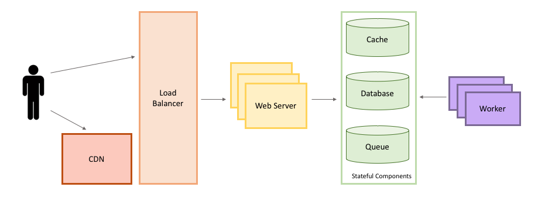

1000个线程同时运行，怎么防止不卡？

**1000 多个并发线程，10 台机器，每台机器 4 核，设计线程池大小。**

要设计一款聊天软件，你打算采用什么方案？

图片上传的功能，后端开发一个接口,前端传图片到后端上面。中间过程网络通信的过程是什么样的？

优化图片上传的吞吐量怎么优化？

## 如何准备系统设计题（场景题）

### 系统的具体要求

1. 包含哪些功能。
2. 系统达到多少QPS？

###  抽象设计

### 考虑系统需要优化的点

1. 是否需要部署多台机器进行负载均衡？
2. 数据库是否需要指定字段索引？是否需要读写分离？是否需要缓存？
3. 数据库是否需要分库分表？
4. 是否需要分布式系统？
5.   .... 

### 从三方面考虑

1. 高性能架构设计：常见性能优化手段比如引入 读写分离、缓存、负载均衡、异步 
2. 高可用性：CAP理论和BASE理论、通过集群来提高系统整体稳定性、超时和重试机制、应对接口级故障：降级、熔断、限流、排队。
3. 高扩展架构设计：责任链、SPI热拔插技术。

### 技术选型

实现同样的功能，一般会有多种技术选择方案，比如缓存用Redis 还是 Memcached、网关用 Spring Cloud Gateway 还是Netflix Zuul2 。 很多时候，面试官在系统设计面过程中会具体到技术的选型，因而，你需要区分不同技术的优缺点

### 相关性能指标

#### 性能指标

**并发数：**

1. QPS：每秒可执行的查询次数；
2. TPS：服务器每秒处理的事务数；

**吞吐量：**

1. QPS（TPS） = 并发数/平均响应时间(RT)
2. 并发数 = QPS * 平均响应时间(RT)

**系统活跃度**

1. PV：网站点击量
2. UV：一天独立访客的次数。 即同一个客户访问多次只算1个点击量。
3. DAU：活跃用户数量。
4. MAU：月活跃用人数

# 系统架构设计

系统架构主要考虑4点：

**高并发**

**高扩展**

**高可用**

**安全性**

## 高并发

高并发实现的三板斧：缓存、限流和降级

### 缓存

影响命中率的因素有：

1. 实时性要求越低越适合缓存：缓存通常适合读多写少的业务场景，反之的使用意义并不多，命中率会很低。
2. 通常情况下缓存的粒度越小，命中率越高：比如说一个用户信息的对象和一个集合。
3. 缓存的容量和基础设施：目前多数的缓存框架和中间件都采用LRU这个算法，有的采用本地内置的应用缓存，容易 出现单机瓶颈，而采用分布式缓存更容易扩展。

#### 本地缓存的实现

本地缓存指的就是在本地内存里边存放数据，当有请求来的时候，就会先从本地缓存中获取，没有的话再从redis或mysql中获取。

常见的本地缓存有比如说

1. Guava Cache
2. Caffeine
3. ConcurrentHashMap

ConcurrentHashMap是线程安全，但是其最大的缺点就是 本地缓存没办法自动删除，需要自己手动删除。那么Guava和Caffeine则提供了定时删除，LRU算法移除等功能。

通过对guava cache 和caffeine 从性能到算法及使用的对比中，可以发现Caffeine基本是在Guava的基础上进行优化而来的，提供的功能基本一致，但是通过对算法和部分逻辑的优化，完成了对性能极大的提升，而且我们可以发现，两者切换几乎没有成本，毕竟caffeine就是以替换guava cache为目的而来的。

#### 分布式缓存实现

即利用Redis来实现分布式缓存。

常见的问题也就是Redis的问题，缓存雪崩，缓存击穿，缓存穿透，缓存污染和数据库缓存一致性问题

#### 缓存污染

缓存污染问题说的是缓存中一些只会被访问一次或者几次的的数据，被访问完后，再也不会被访问到，但这部分数据依然留存在缓存中，消耗缓存空间。

缓存污染会随着数据的持续增加而逐渐显露，随着服务的不断运行，缓存中会存在大量的永远不会再次被访问的数据。缓存空间是有限的，如果缓存空间满了，再往缓存里写数据时就会有额外开销，影响Redis性能。这部分额外开销主要是指写的时候判断淘汰策略，根据淘汰策略去选择要淘汰的数据，然后进行删除操作

#### 数据一致性

**缓存旁路模式：**

这是最最最常用的方法，读的时候先读缓存，没有的话再读数据库，然后再从数据库中放入缓存，同时响应。**更新的时候**，先更新数据库，然后再删除缓存。

存在的问题：

1. 一个是查询操作，一个是更新操作的并发，首先，没有了删除cache数据的操作了，而是先更新了数据库中的数据，此时，缓存依然有效，所以，并发的查询操作拿的是没有更新的数据，但是，更新操作马上让缓存的失效了，后续的查询操作再把数据从数据库中拉出来。而不会像文章开头的那个逻辑产生的问题，后续的查询操作一直都在取老的数据。

   

**队列+重试队列**

- 更新数据库数据；
- 缓存因为种种问题删除失败
- 将需要删除的key发送至消息队列
- 自己消费消息，获得需要删除的key
- 继续重试删除操作，直到成功

然而，该方案有一个缺点，对业务线代码造成大量的侵入。

**异步更新缓存（基于订阅binlog的同步机制）**

**整体思路：**

MySQL binlog增量订阅消费+消息队列+增量数据更新到redis。

1. 读Redis：热数据基本都在Redis。
2. 写MySQL: 增删改都是操作MySQL。
3. 更新Redis数据：MySQ的数据操作binlog，来更新到Redis。

这种方法可以使用像canel框架来完成，我们知道mysql的从库的备份请求，可以使得redis的数据更新达到相同的效果。

#### 高并发缓存的问题

1. **缓存一致性问题：**保证缓存中的数据与数据库中的保持一致，以及主库和从库一致性的问题。

2. **缓存并发问题：**在高并发场景下，有可能多个请求并发的去从数据库获取数据，对后端数据库造成极大的冲击，甚至导致 “雪崩”现象。

3. **缓存穿透问题：**在高并发场景下，如果某一个key被高并发访问，没有被命中，出于对容错性考虑，会尝试去从后端数据库中获取，从而导致了大量请求达到数据库，而当该key对应的数据本身就是空的情况下，这就导致数据库中并发的去执行了很多不必要的查询操作，从而导致巨大冲击和压力。

4. **缓存雪崩：**缓存雪崩就是指由于缓存的原因，导致大量请求到达后端数据库，从而导致数据库崩溃，整个系统崩溃，发生灾难

   

#### 合理使用缓存

1. 频繁修改的数据不需要加入缓存
2. 热点访问的数据
3. 数据一致性要保证，一般会对缓存的数据设置失效时间，一旦超过失效时间，就要从数据库中重新加载。
4. 缓存预热

### 限流

#### 令牌桶

令牌桶算法是网络流量整形（Traffic Shaping）和速率限制（Rate Limiting）中最常使用的一种算法。先有一个木桶，系统按照固定速度，往桶里加入Token，如果桶已经满了就不再添加。当有请求到来时，会各自拿走一个Token，取到Token 才能继续进行请求处理，没有Token 就拒绝服务。

比如说guava的RateLimiter就是使用令牌桶而实现的。

#### 漏桶方式

水(请求)先进入到漏桶里,漏桶以一定的速度出水(接口有响应速率),当水流入速度过大会直接溢出（访问频率超过接口响应速率),然后就拒绝请求,可以看出漏桶算法能强行限制数据的传输速率。

#### 计数器方式

主要用来限制总并发数，比如数据库连接池大小、线程池大小、程序访问并发数等都是使用计数器算法。

1. 采用**AtomicInteger：**如果超过域值就简单粗暴的直接响应给用户

   缺点：可能只是瞬时的请求量高，也会拒绝请求。

2. 采用 **Semaphore信号量**实现 ： 使用Semaphore信号量来控制并发执行的次数，如果超过域值信号量，则进入阻塞队列中排队等待获取信号量进行执行。如果阻塞队列中排队的请求过多超出系统处理能力，则可以在拒绝请求。

   相对Atomic优点：如果是瞬时的高并发，可以使请求在阻塞队列中排队，而不是马上拒绝请求，从而达到一个流量削峰的目的。

3. 采用 **ThreadPoolExecutor**线程池实现：固定线程池大小,超出固定先线程池和最大的线程数,拒绝线程请求;

### 降级

> 常见的容错模式主要包含以下几种方式

- 主动超时：Http请求主动设置一个超时时间，超时就直接返回，不会造成服务堆积
- 限流：限制最大并发数
- 熔断：当错误数超过阈值时快速失败，不调用后端服务，同时隔一定时间放几个请求去重试后端服务是否能正常调用，如果成功则关闭熔断状态，失败则继续快速失败，直接返回。（此处有个重试，重试就是弹性恢复的能力）
- 隔离：把每个依赖或调用的服务都隔离开来，防止级联失败引起整体服务不可用
- 降级：服务失败或异常后，返回指定的默认信息

由于爆炸性的流量冲击，对一些服务进行有策略的放弃，以此缓解系统压力，保证目前主要业务的正常运行。

#### 降级服务的特征

- 原因：整体负荷超出整体负载承受能力。

- 目的：保证重要或基本服务正常运行，非重要服务延迟使用或暂停使用

- 大小：降低服务粒度，要考虑整体模块粒度的大小，将粒度控制在合适的范围内

- 次序：一般从外围延伸服务开始降级，需要有一定的配置项，重要性低的优先降级，比如可以分组设置等级1-10，当服务需要降级到某一个级别时，进行相关配置

#### 降级方式

1. **延迟服务：** 对于实时性不是特别强的服务可以放到缓存中，等服务平稳后再执行。
2. **服务关闭**：在粒度范围内关闭服务（片段降级或服务功能降级）：比如关闭相关文章的推荐，直接关闭推荐区。
3. **页面异步请求降级**：比如商品详情页上有推荐信息/配送至等异步加载的请求，可以进行降级。
4. **页面跳转（页面降级）**：比如可以有相关文章推荐，但是更多的页面则直接跳转到某一个地址。
5. **写降级：**比如秒杀抢购，我们可以只进行Cache的更新，然后异步同步扣减库存到DB，保证最终一致性即可，此时可以将DB降级为Cache。
6. **读降级：**比如多级缓存模式，如果后端服务有问题，可以降级为只读缓存，这种方式适用于对读一致性要求不高的场景。

#### 降级预案

在进行降级之前要对系统进行梳理，看看系统是不是可以丢卒保帅；从而梳理出哪些必须誓死保护，哪些可降级；比如可以参考日志级别设置预案：

- **一般：** 比如有些服务偶尔因为网络抖动或者服务正在上线而超时，可以自动降级；
- **警告：**有些服务在一段时间内成功率有波动（如在95~100%之间），可以自动降级或人工降级，并发送告警；
- **错误：**比如可用率低于90%，或者数据库连接池被打爆了，或者访问量突然猛增到系统能承受的最大阀值，此时可以根据情况自动降级或者人工降级；
- **严重错误：**比如因为特殊原因数据错误了，此时需要紧急人工降级。

#### 服务降级需考虑问题

- 核心服务或非核心服务。

- 是否支持降级，及其降级策略。
- 业务放通场景，及其策略。

### 熔断

在互联网系统中，当下游服务因访问压力过大而响应变慢或失败，上游服务为了保护系统整体的可用性，可以暂时切断对下游服务的调用。

#### 熔断流程

熔断流程通常通过断路器（Curcuit Breaker）模式实现，那断路器模式的熔断流程则是有两个基本状态(close和open)和一个基本trip动作：

- close状态下，断路器是关着
- open状态下，断路器是开着
- trip状态下，如果supplier持续超时报错，达到规定的阈值后，就会关闭。

#### 扩展的断路器模式

基本的断路器模式下，保证了断路器在open状态时，保护supplier不会被调用， 但我们还需要额外的措施可以在supplier恢复服务后，可以重置断路器。一种可行的办法是断路器定期探测supplier的服务是否恢复， 一但恢复， 就将状态设置成close。断路器进行重试时的状态为半开（half-open）状态。

#### 服务熔断与服务降级比较

服务熔断一般是某个服务（下游服务）故障引起，而服务降级一般是从整体负荷考虑。

共性： 

- 目的 -> 都是从可用性、可靠性出发，提高系统的容错能力。
- 最终表现->使某一些应用不可达或不可用，来保证整体系统稳定。
- 粒度 -> 一般都是服务级别，但也有细粒度的层面：如做到数据持久层、只许查询不许增删改等。
- 自治 -> 对其自治性要求很高。都要求具有较高的自动处理机制。

区别： 

- 触发原因 -> 服务熔断通常是下级服务故障引起；服务降级通常为整体系统而考虑。
- 管理目标 -> 熔断是每个微服务都需要的，是一个框架级的处理；而服务降级一般是关注业务，对业务进行考虑，抓住业务的层级，从而决定在哪一层上进行处理：比如在IO层，业务逻辑层，还是在外围进行处理。
- 实现方式 -> 代码实现中的差异。

#### Hystrix

1. **支持`Half-Open`**：当Hystrix Command请求后端服务失败数量超过一定比例(默认50%), 断路器会切换到开路状态(Open). 这时所有请求会直接失败而不会发送到后端服务. 断路器保持在开路状态一段时间后(默认5秒), 自动切换到半开路状态。

2. **服务降级：**Fallback相当于是降级操作. 对于查询操作, 我们可以实现一个fallback方法, 当请求后端服务出现异常的时候, 可以使用fallback方法返回的值. fallback方法的返回值一般是设置的默认值或者来自缓存

3. **线程池隔离：**

   

#### Sentinel

Sentinel 是阿里中间件团队开源的，面向分布式服务架构的轻量级高可用流量控制组件，主要以流量为切入点，从流量控制、熔断降级、系统负载保护等多个维度来帮助用户保护服务的稳定性。  

其相对于HyStrix的优势在于

1. 丰富的应用场景：Sentinel 承接了阿里巴巴近 10 年的双十一大促流量的核心场景，有实际的成功案例。
2. 完善的实时监控
3. 也有完善的SPI机制
4. Hystrix在github上已经不作更新了

## 高可用

高可用主要包括了 **负载均衡、容灾备份、故障转移**

### 负载均衡分类

根据实现技术不同，可分为DNS负载均衡，HTTP负载均衡，IP负载均衡，链路层负载均衡等。

#### DNS负载均衡

负载均衡技术，利用域名解析实现负载均衡，在DNS服务器，配置多个A记录，这些A记录对应的服务器构成集群。

**优点**

- 使用简单：负载均衡工作，交给DNS服务器处理，省掉了负载均衡服务器维护的麻烦
- 提高性能：可以支持基于地址的域名解析，解析成距离用户最近的服务器地址，可以加快访问速度，改善性能；

**缺点**

- **可用性差**：DNS解析是多级解析，新增/修改DNS后，解析时间较长；解析过程中，用户访问网站将失败；
- **扩展性低**：DNS负载均衡的控制权在域名商那里，无法对其做更多的改善和扩展；
- **维护性差**：也不能反映服务器的当前运行状态；支持的算法少；不能区分服务器的差异（不能根据系统与服务的状态来判断负载）

#### IP负载均衡

在网络层通过修改请求目标地址进行负载均衡。

用户请求数据包，到达负载均衡服务器后，负载均衡服务器在操作系统内核进程获取网络数据包，根据负载均衡算法得到一台真实服务器地址，然后将请求目的地址修改为，获得的真实ip地址，不需要经过用户进程处理。

- 优点
  - 在内核进程完成数据分发，比在应用层分发性能更好；
- 缺点
  - 所有请求响应都需要经过负载均衡服务器，集群最大吞吐量受限于负载均衡服务器网卡带宽；

#### 链路层负载均衡

在通信协议的数据链路层修改mac地址，进行负载均衡。

数据分发时，不修改ip地址，指修改目标mac地址，配置真实物理服务器集群所有机器虚拟ip和负载均衡服务器ip地址一致，达到不修改数据包的源地址和目标地址，进行数据分发的目的。

优点：性能好；

缺点：配置复杂；

**DR模式是目前使用最广泛的一种负载均衡方式。**

#### 常见负载均衡服务器

**四层负载均衡**

LVS：重量级软件，本身不支持正则表达式，部署起来比较麻烦，但是性能高，应用范围广，一般的大型互联网公司都有用到。

Nginx：轻量级软件，支持的协议少（HTTP、HTTPS和Email协议），对于Session支持不友好。

**七层负载均衡**

Nginx：可以针对HTTP应用进行分流，正则规则灵活，支持高并发，部署简单。

HAProxy：全面支持七层代理，灵活性高，支持Session会话保持。

#### 七层负载均衡和四层负载均衡

四层的负载均衡是基于IP和端口实现的，七层的负载均衡是在四层的基础上，基于URL等信息实现

1. 七层负载均衡：基本都是基于http协议，适用于web服务器的负载均衡

2. 四层负载均衡：基于TCP协议，可以做任何基于tcp/ip协议的负载均衡（haproxy, LVS）

3. 二者主要区别在于利用的报文所在的层面是不同的，各有各的好处。

4. 七层负载均衡的好处，是使得整个网络更“智能化”。例如访问一个网站的用户流量，可以通过七层的方式，将对图片类的请求转发到特定的图片服务器，并可以利用缓存技术；将对文字类的请求转发到特定的文字服务器，并可以利用压缩技术。

5. 从技术原理上，七层负载可以对客户端的请求和服务器的响应进行任何意义上的修改，极大的提升了应用系统在网络层的灵活性。例如nginx或apache上部署的功能可以迁移到负载均衡器上，例如客户请求中的Header重写，服务器响应中的关键字过滤或内容插入等功能。

6. 四层负载均衡的优点是较为灵活，可以作为多种软件的负载均衡器。

   

## 容灾备份

- **容灾**是为了在遭遇灾害时能保证信息系统能正常运行，帮助企业实现业务连续性的目标；
  - **容错（fault tolerance）**: 发生故障时，系统还能继续运行。容错的目的是，发生故障时，系统的运行水平可能有所下降，但是依然可用，不会完全失败。
  - **容灾（Disaster Tolerance）**：就是在上述的灾难发生时，在保证生产系统的数据尽量少丢失的情况下，保持生存系统的业务不间断地运行。容灾通常是通过冗余方式来实现的。
- **备份**是为了应对灾难来临时造成的数据丢失问题。

容灾分为三个级别：

1. **数据级容灾**是指通过建立异地容灾中心，做数据的远程备份，在灾难发生之后要确保原有的数据不会丢失或者遭到破坏，但在数据级容灾这个级别，发生灾难时应用是会中断的。可以理解为一个远程的数据备份中心。
2. **应用级容灾**是在数据级容灾的基础之上，在备份站点同样构建一套相同的应用系统，通过同步或异步复制技术，这样可以保证关键应用在允许的时间范围内恢复运行，尽可能减少灾难带来的损失，**让用户基本感受不到灾难的发生，**这样就使系统所提供的服务是完整的、可靠的和安全的。
3. **业务级容灾**是全业务的灾备，除了必要的IT相关技术，还要求具备全部的基础设施。

### 容灾备份等级

1. 0级无异地备份：0等级容灾方案数据仅在本地进行备份，没有在异地备份数据，未制定灾难恢复计划。
2. 1级实现异地备份：将关键数据备份到本地磁带介质上，然后送往异地保存，但异地没有可用的备份中心、备份数据处理系统和备份网络通信系统，未制定灾难恢复计划。
3. 2级热备份站点备份：第2级容灾方案是将关键数据进行备份并存放到异地，制定有相应灾难恢复计划，具有热备份能力的站点灾难恢复。
4. 3级在线数据恢复：利用异地的备份管理软件将通过网络传送到异地的数据备份到主机系统。一旦灾难发生，需要的关键数据通过网络可迅速恢复，通过网络切换，关键应用恢复时间可降低到一天或小时级。
5. 4级定时数据备份：在第3级容灾方案的基础上，利用备份管理软件自动通过通信网络将部分关键数据定时备份至异地，并制定相应的灾难恢复计划。
6. 5级实时数据备份：可以实现在应用站点与备份站点的数据都被更新
7. 6级零数据丢失：容灾方案是灾难恢复中最昂贵的方式，也是速度最快的恢复方式，它是灾难恢复的最高级别，利用专用的存储网络将关键数据同步镜像至备份中心，数据不仅在本地进行确认，而且需要在异地（备份）进行确认。

### 容灾备份解决方案，来自于阿里云官方文档

#### ECS的容灾备份

1. **备份恢复：**阿里云ECS可通过**快照**与**镜像**对系统盘、数据盘进行备份。另外ECS可通过镜像重新初始化磁盘或使用自定义镜像新购ECS实例。
2. **容灾应用**：ECS可以从架构上实现容灾场景下的应用。
   - **负载均衡SLB**：设备侧通过多可用区级别SLB做首层流量接入，用户流量被分发至两个及以上的可用区机房，机房内均部署ECS集群。（SLB是将访问流量根据转发策略分发到后台多台云服务器(ECS实例)的流量分发控制服务，来实现多台服务器提供相同的业务服务。）
   - **ECS集群**：可用区机房部署的ECS节点是对等的，单节点故障不影响数据层应用和服务器管控功能。
   - **数据层**：在地域级别部署对象存储，不同可用区机房的ECS节点可以直接读取文件信息。

#### 同城容灾

**同城容灾**指应用服务部署是**多机房、单地域**时，当其中一机房出现故障时，系统可实现业务7*24小时稳定运行，即使单机房故障也不影响业务的可持续性，保障用户访问连续不间断。

**同城双活容灾架构**

是指在同城建立两个可独立承担关键系统运行的数据中心，双中心具备基本等同的业务处理能力并通过高速链路实时同步数据，日常情况下可同时分担业务及管理系统的运行，并可切换运行

#### 异地容灾

**异地容灾**是指应用服务部署在不同地域时，当其中一地出现故障时，系统可以将出现故障地域的用户访问流量，调度至异地灾备中心，保障用户访问连续不间断。

**两地三中心容灾**架构，是指在同城双中心的基础上，在异地的城市建立一个备份的灾备中心，用于双中心的数据备份，当双中心出现自然灾害等原因而发生故障时，异地灾备中心可以用备份数据进行业务的恢复。

### 故障转移和恢复

1. 故障转移（failover），即当活动的服务或应用意外终止时，快速启用冗余或备用的服务器、系统、硬件或者网络接替它们工作。

2. 故障转移(failover)与交换转移操作基本相同，只是故障转移通常是**自动完成**的，没有警告提醒手动完成，而交换转移需要手动进行。

#### 如何进行故障转移

1. 在**主动-主动**设置中，多个节点同时运行。这允许他们分担工作量并防止任何一个节点过载。如果一个节点停止工作，它的工作负载将被其他活动节点占用，直到它重新激活。
2. **主动-被动**（主动-备用）设置还包括多个节点，但并非所有节点都同时处于活动状态。一旦主动节点停止工作，被动节点就会被激活并充当故障转移节点。当主节点再次运行时，数据备份节点将操作切换回主节点并再次变为被动状态。

#### 什么是故障恢复

故障恢复是在计划内或计划外中断解决后**切换回主站点**的过程。故障恢复通常在故障转移之后作为灾难恢复计划的一部分。

#### 如何进行故障恢复

成功执行故障回复需要一些准备。在切换回主站点之前，请考虑以下步骤：

1. 检查与主站点的连接的质量和网络带宽。
2. 检查备份站点上的所有数据是否存在潜在错误。这对于关键文件和文档尤其重要。
3. 在开始故障恢复之前彻底测试所有主系统。
4. 准备并实施故障恢复计划，以最大限度地减少停机时间和用户不便。

