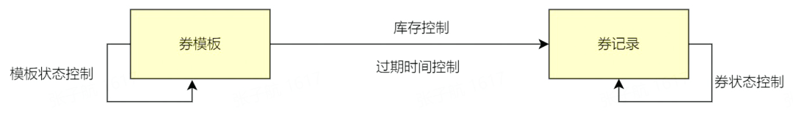

# 秒杀系统

### 秒杀系统的逻辑

1. 秒杀开始的时候，会有大量用户同时参与进来，因此秒杀系统一定要满足 高并发和高性能 。
2. 为了保证秒杀整个流程的顺利进行，整个秒杀系统必须要满足 高可用 。
3. 除此之外，由于商品的库存有限，在面对大量订单的情况下，一定不能超卖，我们还需要保证 一致性 。

## 会话管理

单体应用的本地会话管理方式无法应用于分布式项目中。单体模式中用户是否登陆通常从Tomcat容器的session中获取用户信息进行判断。

分布式应用中，在应用层有多台应用服务器，用户的每次请求可能打在不同的服务器上，每一个服务器都是用自己本地Tomcat容器进行会话管理，必定无法全部保存用户会话信息。

**传统的解决方式**：

- 使用Nginx基于Hash的路由方式进行固定用户路由：*并不很灵活，难以解耦*
- 基于Cookie携带用户的sessionId，在登陆后session中设置布尔值isLogin，以及用户对象loginUser作为登陆依据和获取用户对象的依据：如果用户端禁止Cookie，就无法通过Cookie传输sessionId

**基于Redis的token会话管理体系**：

使用Redis作为集中式的用户会话信息的缓存中间件，所有应用服务器需要进行用户身份验证，在Redis中进行查找

- 数据结构：value使用string类型，存储**{ token, userModel }**，其中key: token是UUID，value：是用户对象，使用JSON格式存储
- 使用代码：
- **redisTemplate.opsForValue().set(token, userModel)**，这在Redis层是**set token usermodel**
- 过期时间(一小时)：**redisTemplate.expire(token, 1, TimeUnit.HOURS)**，Redis层**expire token 3600**
- 如何验证
- 前端在login.html的逻辑里，将token存在本地的localStorage中（H5新特性，4MB大小，比4KB Cookie更大）：**window.localStorage[’token’] = data.data**
- 在之后的动态请求中：URL后附带参数 **’?token=’+token**
- 也可以放在请求体中

**如何进一步优化？**

**目前的问题**：每个请求都要校验用户登陆，很麻烦，代码冗余度很高

可以基于拦截器进行通用的Controller层用户登陆信息校验，拦截器在指定的Controller模块前执行，完成一些强制性操作，把基于token的逻辑放在preHandle()中

## 高性能

### 热点数据处理

处理热点数据的问题的关键就在于 我们如何找到这些热点数据（或者说热 key），然后将它们存在 jvm 内存里。 

**如何检测热点数据？**比如说我了解到市面上也有一些类似的中间件，比如说京东零售的hotkey就是一款专门用于检测热点数据的中间件，可以毫秒级探测热点数据，毫秒级推送至服务器集群内存。

**如何处理热点数据？**热点数据一定要放在缓存中，并且最好可以写入到 jvm 内存一份（多级缓存），并设置个过期时间。需要注意写入到 jvm 的热点数据不宜过多，避免内存占用过大，一定要设置到淘汰策略。

### 静态资源处理

秒杀会涉及到很多静态资源比如说商品图片、CSS、JS等等，就可以使用CDN的方法。

## 高可用

### 集群化

可以直接通过 Redis replication（异步复制） 搞个一主(master)多从(slave)来提高可用性和读吞吐量，slave 的多少取决于你的读吞吐量。

可以通过 Sentinel（哨兵） 来解决。Redis Sentinel 是 Redis 官方推荐的高可用性(HA)解决方案。

### 接口限流

1. **接口限流的话**可以直接用 Redis 来做（建议基于 Lua 脚本），也可以使用现成的流量控制组件比如 Sentinel 、Hystrix 、Resilience4J 。
2. **问题/验证码：**可以在用户发起秒杀请求之前让其进行答题或者输入验证码。
3. **提前预约：**可以对预约的这些人进行筛选，通过某些方式找出潜在的黄牛。
4. **流量削峰：**可以使用消息队列进行流量削峰。

### 服务降级

降级的核心思想就是丢车保帅，优先保证核心业务。

降级的目的在于应对系统自身的故障，而熔断的目的在于应对当前系统依赖的外部系统或者第三方系统的故障。

### 熔断

熔断可以防止因为秒杀交易影响到其他正常服务的提供。

## 接口幂等

什么是幂等呢? 在分布式系统中，幂等(idempotency)是对请求操作结果的一个描述，这个描述就是不论执行多少次相同的请求，产生的效果和返回的结果都和发出单个请求是一样的。

**前端方法：**

一般通过当用户提交请求后将按钮至灰色就能保证。

**后端方法：**

1. 同步锁
2. 分布式锁；
3. 业务字段的唯一索性约束，防止重复数据产生。

推荐使用 `Redission`来完成。

# 搭建10万级QPS大流量、高并发的优惠券系统

## 需求拆解和技术选型

### 需求拆解

- 要配置券，会涉及到券批次（券模板）创建，券模板的有效期以及券的库存信息
- 要发券，会涉及到券记录的创建和管理（过期时间，状态）

因此，我们可以将需求先简单拆解为两部分：

同时，无论是券模板还是券记录，都需要开放查询接口，支持券模板/券记录的查询。

### 系统选型以及中间件

1. **存储：**需要持久化的数据，因此我们选用MySQL作为我们的中间件。
2. **缓存：** 模板信息和库存扣减是一个高频、实时的操作，需要考虑放入到缓存中。主流的缓存 Redis 可以满足我们的需求，因此我们选用 Redis 作为缓存中间件。
3. **消息队列：** 券模板和券记录都需要过期状态

### 大流量、高并发场景下的问题及解决方法

#### 瓶颈：

1. 单个 MySQL 的每秒写入在 4000 QPS 左右，超过这个数字，MySQL 的 I/O 时延会剧量增长。
2. MySQL的单表记录超过千万级别后，查询效率会大大降低。
3. Redis 单分片的写入瓶颈在 2w 左右，读瓶颈在 10w 左右

#### 解决方法

1. 读写分离
2. 分库分表
3. Redis扩容

## 优惠券发放方式设计

为了满足不同场景的发券需求，优惠券系统提供了三种发券方式：统一领券接口、后台定向发券、券码兑换发放。

[vivo 全球商城：优惠券系统架构设计与实践 - vivo互联网技术 - 博客园 (cnblogs.com)](https://www.cnblogs.com/vivotech/p/15117264.html)

## 热点库存问题和解决方法

### 问题一： 

问题：大流量发券场景下，如果我们所访问的模板是一个的话，那么必然会有大流量集中在这个redis的分片中，容易造成瓶颈

解决方法：

扣减的库存 key 不要集中在某一个分片上。实现方法就是拆key即可。在业务逻辑中，我们在建券模板的时候，就将这种热点券模板做库存拆分，后续扣减库存时，也扣减相应的子库存即可。

### 问题二：券模板获取失败问题及解决方案

**问题：**高 QPS，高并发的场景下，如何将接口的成功率提升 0.01%。

**解决方法：**有两种方法

1. 从 Redis 获取券模板失败时，内部进行重试；二是将券模板信息缓存到实例的本地内存中，即引入**二级缓存**。
2. 引入了本地缓存，我们还需要在每个服务实例中启动一个定时任务来将最新的券模板信息刷入到本地缓存和 Redis 中，将模板信息刷入 Redis 中时，要加分布式锁，防止多个实例同时写 Redis 给 Redis 造成不必要的压力

### 服务治理

1. 超时设置。让其不会被上游系统的故障而拖垮。
2. 监控与报警。Netty中我们使用 `IdleStateHandler`来实现。
3. 限流。优惠券系统是一个底层服务，实际业务场景下会被多个上游服务所调用。
4. 资源隔离。服务部署的集群资源尽量分布在不同的物理区域上，以避免由集群导致的服务不可用。

# 直播平台

[直播平台的相关技术（转载） - 夏天/isummer - 博客园 (cnblogs.com)](https://www.cnblogs.com/icmzn/p/5931490.html)

技术挑战场景是：

1. 视频流的处理、分发
2. 播放质量保障
3. 视频可用性监控
4. 超大直播间实时弹幕及聊天互动
5. 高性能消息通道
6. 内容控制，如算法鉴黄、文本过滤
7. 系统可用性、稳定性保障

### 视频直播

这里主要的问题就是，为了支持多终端(PC、Andriod、[iOS](http://lib.csdn.net/base/ios)、HTML5)观看，需要对输入流进行编码及封装格式的转换。转码完成之后，还需要对视频流进行分发，毕竟源站的负载能力有限，节点数有限，离大部分用户的物理距离远，对视频这一类十分占用带宽资源的场景来说，为了提高播放质量减少卡顿，需要尽量减少到用户的传输链路。

1. 通常的做法就是将视频流进行切片存储到分布式文件系统上，分发到CDN，或者是直接通过CDN进行流的二级转发。
2. 客户端对延时的要求，以及采用何种协议，决定了视频是否需要分片，分片的目的在于，通过HTTP协议，用户不需要下载整个视频，只需要下载几个分片，就可以播放。

### 消息/弹幕

解决上行大QPS和下行更大的QPS问题。 也就是弹幕。对于消息通道来说，无疑将是一个巨大的挑战。因此，在系统设计的时候，首先要考虑的问题，就是如何降低消息通道的压力。

1. 首先对弹幕进行一系列的过滤。
2. 为了避免系统被瞬间出现的峰值压垮，可先将消息投递到消息队列，削峰填谷，在流量的高峰期积压消息，给系统留一定裕度，降低因限流丢消息对业务产生的影响。
3. 后端始终以固定的频率处理消息，通过异步机制保障峰值时刻系统的稳定，这是一个典型的生产者—消费者模型。
4. 对于消息的消费端，则可采用多线程模型以固定的频率从消息队列中消费消息，遍历对应房间所对应的在线人员列表，将消息通过不同的消息通道投递出去。
   - 异步使用大集群并行处理。

除了采用消息队列异步处理之外，当房间人数太多，或者消息下行压力太大的情况下，还需要进一步降低消息下行通道的压力，就需要使用**分桶策略**

**分桶策略**就是为了提高弹幕的可读性。可以将用户较为均衡的分配到每个桶，

同时也要使用心跳来维持服务端的在线人员列表，首要的就是选择通信协议，也就是使用WebSocket和TCP协议的好处显而易见的，通信效率会比HTTP协议高很多，并且这两种协议支持双工通信。

### 消息通道

对于需要与服务端进行频繁交互的即时通讯场景来说，需要使用websocket来实现。

# 设计一个短链系统

对于使用者更加友好，短链更简洁，更方便传播：过长的链接不利于在互联网传播；

### 唯一短链生成

通过哈希算法对长链去哈希。

### 判断短链是否被使用

1. 在数据库中使用唯一索引。
2. 但为了提高并发和应对高并发，可以使用redis的布隆过滤器。

# 设计红包系统

**具体流程就是：**

B2C 和 C2C 红包的领取流程都是一样的。用户在抖音刷视频遇到有视频红包的视频时，视频下方有个领取红包按钮，用户点击红包领取，会弹出到红包封面，用户点击红包封面的开红包后即可领取红包，领取成功后会显示领取结果弹窗，在领取结果中用户可以看领取金额，以及跳转到领取详情页，在领取详情页中可以看到这个红包其他用户的领取手气。

### 模块划分

1. 红包网关服务：HTTP API 网关，对外对接客户端和 h5，对内封装各个系统 rpc 接口，限流，权限控制、降级等功能

## **如何面向内存实现一个map数据结构？如何设计存储协议、写入/检索策略？**

本题主要考察的点在于存储协议的设计，以及基于写入/检索的需求来优化存储协议；首先需要阐述清楚如何设计存储协议能够实现map结构的正常put/get操作，例如：

> 1、最简单的回答，使用一个二维对象数组，index 0 作为key，index 1 作为 value，然后一维值每一个元素即是一对KV，记录一个当前的size，put就直接在尾部追加，get则遍历比对key值。
>
>  
>
> 2、进阶一些的，使用一个一维字节数组，然后每一对KV使用一个不定长的存储单元，该存储单元的协议设计为[4字节单元长度][4字节key长度][key内容][value内容]，然后记录一个全局的index标记，put就在尾部追加存储单元，get则遍历比对key值
>
>  
>
> 3、更进阶一些的，下列都属额外加分项：
> ①如果优化检索效率？例如：针对i,可以利用key散列使用多个二维数组；针对ii，可以利用key散列使用多个字节数组。
> ②如何支持多线程安全操作？回答copyonwrite；同步锁计算存储长度，并发进行内容写入等答案皆可，并发实现有非常多解决方案。

## **如何面向磁盘实现一个map数据结构？如何设计存储协议、写入/检索策略？**

和上一题类似，但是因为基于磁盘，所以你没法直接采用多维对象数组的方式，而是

> 1、将文件映射成为一个多维数组依然可行，例如最简单的使用一个properties文件，一行一组KV，天然就支持了这个结构。
>
>  
>
> 2、进阶一些的，采用类似上一题中一维字节数组的协议设计，把一个文件映射到内存，或者直接操作文件流皆可，具体方式就按上一题的设计，只是载体发生了变化
>
>  
>
> 3、更进阶一些的，下列都属额外加分项：
> ①优化检索效率，上一题中提到的方案依然适用，但是载体发生了变化，变为使用多个文件；
> ②如果支持多线程安全操作？同样可以采取上题中说到的方案，但是因为文件系统的特殊性，copyonwrite策略需要做一些调整，例如做A/B完整备份的方案，在写时临时使用其中一个作为写副本，另一个读，写结束后同步；同步锁计算存储长度，并发内容写入的方案依然适用
> ③基于磁盘如果额外答道考虑顺序读写相关的优化加分

## **如何高效的实现一个可水平扩展的全局ID生成服务？如何保证全局id的唯一性？**

首先需要阐述清楚id的组成策略，最简单的方案：

> 1、64bit长度的id，16bit机器码 + 16bit计数器 + 32bit时间戳秒值（使用一个业务预设值的差值，而并非UNIX时间戳，以节约空间）
>
>  
>
> 2、需要阐述相关设计针对的业务特性，例如上述设计，16bit机器码支持65536台机器同时构建id而不重复；16bit计数器支持在1秒内最高生成65536个id；也就是这个方案支持最高同时1秒内构建65536*65536个id，即该方案支持的最高秒级并发构建上限；32bit时间戳秒值，则声明该方案可以支持在业务预设时间值向后的推移的2000年内都不会产生重复id

## **如何实现一个无锁队列？简述无锁实现的原理与逻辑。并说明优缺点与适用场景？**

1、基本能够阐述清楚lock-free ringbuffer的设计原理即可，阐述无锁链表实现亦可，但无锁链表实现相对复杂度更高，目前也没有太多工业实践，所以需要更多的细节阐述如果保证线程安全性。具体内容使用我前述的关键字都能检索到相关论文，可自行查询。

 

2、优缺点部分，能够提到ringbuffer容量问题，以及CAS竞争问题即可；使用场景也是应这两个特性而具体选择的，能够相互合理解释即可。

## **如何实现一个高效的网络请求服务端？简述通信协议的设计，网络线程模型的设计？**

本题主要考察对网络通信部分实现细节的了解

> 1、基础回答，能够使用同步io，阐述清楚网络协议的设计，如何处理数据正确性等问题即可；例如：
> ①协议部分设计： 协议头[4字节整体长度][4字节协议头长度][协议头内容][协议体内容]
> ②利用协议中的包长度识别数据正确性问题
> ③同步io基本不涉及线程模型设计
> ④如果能够提到使用协议头中添加数据校验位来保证数据正确性加
>
>  
>
> 2、进阶回答，使用异步io，
> ①协议部分设计与同步io时类似，但是需要增加请求标识位概念，以用于对应返回数据包
> ②数据正确性设计与同步io时类似，如果能够提到使用协议头中添加数据校验位来保证数据正确性加分
> ③重点在线程模型设计，主要的点在于io与业务处理线程分离；io线程与业务线程如何交互；两类线程分别按何种指标进行设计，大概的计算方式是怎样（比如一般io线程都以cpu逻辑核心位标准来定数量是因为什么）
>
>  
>
> 3、更多的额外加分项：
> ①如果通过协议设计来进一步压缩请求包大小以提升网络效率
> ②如何处理异常情况来保障服务的可用性？长短链接的选择，优缺点和适用场景
