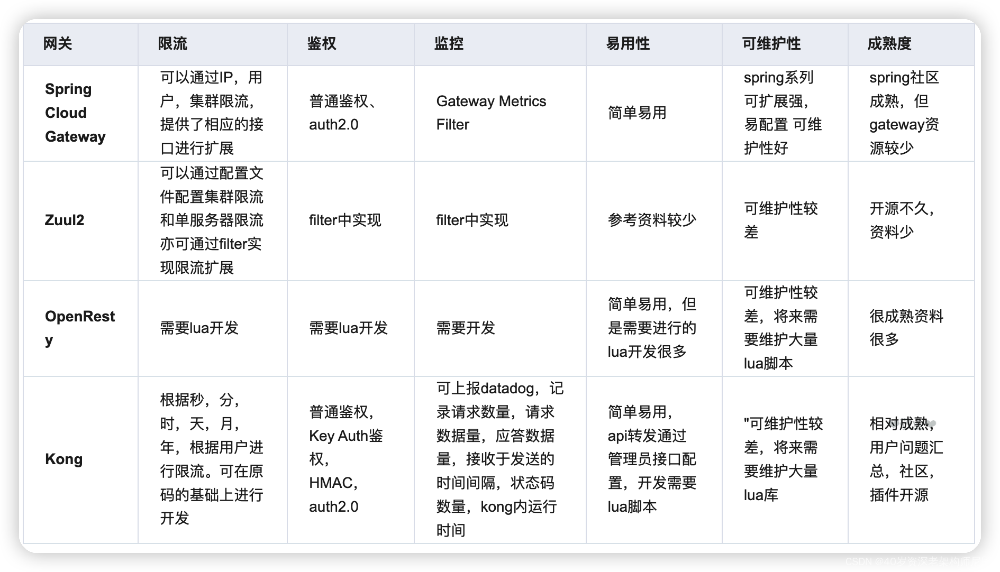
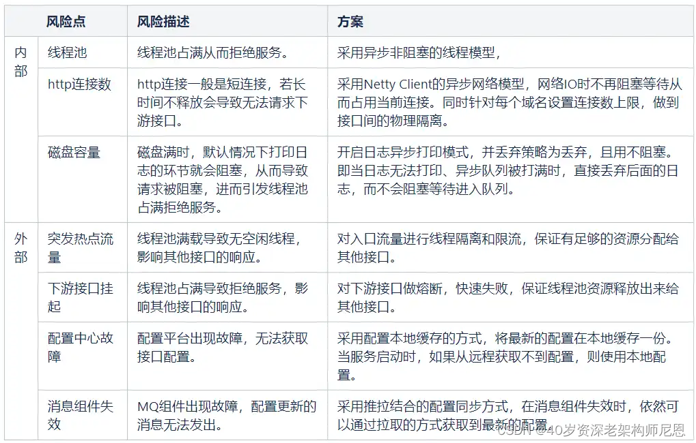

# 网关

网关一词最早出现在网络设备，比如两个相互独立的局域网之间通过路由器进行通信， 中间的路由被称之为网关。

## 几种常见的网关的对比

在对比的时候从六个方面去考量一个网关是否合格：

## 网关的设计重点是什么

无外乎3点，高性能、高可用、高扩展

### 高性能
在技术设计上，网关不应该也不能成为性能的瓶颈。

1. 对于高性能，最好使用高性能的编程语言来实现，如 C、C++、Go 和 Java。
2. 网关对后端的请求，以及对前端的请求的服务一定要使用异步非阻塞的 I/O 来确保后端延迟不会导致应用程序中出现性能问题。C 和 C++ 可以参看 Linux 下的 epoll 和 Windows 的 I/O Completion Port 的异步 IO 模型，Java 下如 Netty、Spring Reactor 的 NIO 框架。
3. 缓存的一些策略方法

### 高性能
因为所有的流量或调用经过网关，所以网关必须成为一个高可用的技术组件，它的稳定直接关系到了所有服务的稳定。网关如果没有设计，就会成变一个单点故障。因此，一个好的网关至少要做到以下几点。

1. **集群化：**网关要成为一个集群，其最好可以自己组成一个集群，并可以自己同步集群数据，而不需要依赖于一个第三方系统来同步数据。
2. **服务化：**网关还需要做到在不间断的情况下修改配置，一种是像 Nginx reload 配置那样，可以做到不停服务，另一种是最好做到服务化。也就是说，得要有自己的 Admin API 来在运行时修改自己的配置。
3. **持续化：**比如重启，就是像 Nginx 那样优雅地重启。有一个主管请求分发的主进程。当我们需要重启时，新的请求被分配到新的进程中，而老的进程处理完正在处理的请求后就退出。

### 高可用

因为网关需要承接所有的业务流量和请求，所以一定会有或多或少的业务逻辑。而我们都知道，业务逻辑是多变和不确定的。比如，需要在网关上加入一些和业务相关的东西。因此，一个好的 Gateway 还需要是可以扩展的，并能进行二次开发的。

### 安全性

因为网关是为用户请求和后端服务的桥接装置，所以需要考虑一些安全方面的事宜。具体如下：

1. **加密数据：**可以把 SSL 相关的证书放到网关上，由网关做统一的 SSL 传输管理。
2. **校验用户的请求：**一些基本的用户验证可以放在网关上来做，比如用户是否已登录，用户请求中的 token 是否合法等。但是，我们需要权衡一下，网关是否需要校验用户的输入。因为这样一来，网关就需要从只关心协议头，到需要关心协议体。而协议体中的东西一方面不像协议头是标准的，另一方面解析协议体还要耗费大量的运行时间，从而降低网关的性能。对此，我想说的是，看具体需求，一方面如果协议体是标准的，那么可以干；另一方面，对于解析协议所带来的性能问题，需要做相应的隔离。
3. **检测异常访问：**网关需要检测一些异常访问，比如，在一段比较短的时间内请求次数超过一定数值；还比如，同一客户端的 4xx 请求出错率太高……对于这样的一些请求访问，网关一方面要把这样的请求屏蔽掉，另一方面需要发出警告，有可能会是一些比较重大的安全问题，如被黑客攻击。

## 网关应用

网关分为两种：

1. **流量网关：**控制流量进入集群的网关,有很多工作需要在这一步做,对于一个服务集群,势必有很多非法的请求或者无效的请求,这时候要将请求拒之门外,降低集群的流量压力。只专注于全局的Api管理策略，比如全局流量监控、日志记录、全局限流、黑白名单控制、接入请求到业务系统的负载均衡等。
2. **业务网关：**权限控制、日志输出、数据加密、熔断限流等，每个微服务应用都需要，因此存在着大量重复的代码实现。

与流量网关相对应的就是业务网关,业务网关更靠近我们的业务,也就是与服务器应用层打交道,那么有很多应用层需要考虑的事情就可以依托业务网关,例如在线程模型、协议适配、熔断限流，服务编排等。

网关的集群有很多种：

1. 总Gateway分发给各个子Gateway
2. 一个服务一个Gateway
3. 一组服务配置一个Gateway

## OpenResty

OpenResty 是一个流量网关,根据前面对流量网关的介绍就可以知道流量网关的指责。

OpenResty 基于 Nginx 与 Lua 的高性能 Web 平台，其内部集成了大量精良的 Lua 库、第三方模块以及大多数的依赖项。用于方便地搭建能够处理超高并发、扩展性极高的动态 Web 应用、Web 服务和动态网关。

## Kong

Kong 基于 OpenResty 开发，也是流量层网关, 是一个云原生、快速、可扩展、分布式的 Api 网关。继承了 OpenResty 的高性能、易扩展性等特点。Kong 通过简单的增加机器节点，可以很容易的水平扩展。同时功能插件化，可通过插件来扩展其能力。所以其底层使用的是Nginx来实现

## Zuul1.0 和 Zuul2.0

Netflix 宣布了通用 API 网关 Zuul 的架构转型。Zuul 原本采用同步阻塞架构，转型后叫作 Zuul2，采用异步非阻塞架构。Zuul2 和 Zuul1 在架构方面的主要区别在于，Zuul2 运行在异步非阻塞的框架上，比如 Netty。Zuul1 依赖多线程来支持吞吐量的增长，而 Zuul 2 使用的 Netty 框架依赖事件循环和回调函数。

前端用 Netty Server 代替 Servlet，目的是支持前端异步。后端用 Netty Client 代替 Http Client，目的是支持后端异步。

**优势**是异步非阻塞模式启动的线程很少，基本上一个 CPU core 上只需启一个事件环处理线程，它使用的线程资源就很少，上下文切换(Context Switch)开销也少。非阻塞模式可以接受的连接数大大增加，可以简单理解为请求来了只需要进队列，这个队列的容量可以设得很大，只要不超时，队列中的请求都会被依次处理。

# SpringCloud Gateway

其诞生的目标是为了替代老牌网关 **Zuul**。准确点来说，应该是 Zuul 1.x。Spring Cloud Gateway 起步要比 Zuul 2.x 更早。

Spring Cloud Gateway 基于 Spring WebFlux 。Spring WebFlux 使用 Reactor 库来实现响应式编程模型，底层基于 Netty 实现同步非阻塞的 I/O。

1. 提供统一的路由方式。
2. 基于 Filter 链的方式提供了网关基本的功能，例如：安全，监控/指标，限流。

### Spring Cloud Gateway的流程

1. **路由判断：** 客户端的请求到达网关后，先经过 Gateway Handler Mapping 处理，这里面会做断言（Predicate）判断，看下符合哪个路由规则，这个路由映射后端的某个服务。
2. **请求过滤：** 然后请求到达 Gateway Web Handler，这里面有很多过滤器，组成过滤器链（Filter Chain），这些过滤器可以对请求进行拦截和修改，比如添加请求头、参数校验等等，有点像净化污水。然后将请求转发到实际的后端服务。这些过滤器逻辑上可以称作 Pre-Filters，Pre 可以理解为“在...之前”。
3. **服务处理：** 后端服务会对请求进行处理。
4. **响应过滤：**后端处理完结果后，返回给 Gateway 的过滤器再次做处理，逻辑上可以称作 Post-Filters，Post 可以理解为“在...之后”。
5. **响应返回**：响应经过过滤处理后，返回给客户端。

客户端的请求先通过匹配规则找到合适的路由，就能映射到具体的服务。然后请求经过过滤器处理后转发给具体的服务，服务处理后，再次经过过滤器处理，最后返回给客户端。

### 断言是什么

在 Gateway 中，如果客户端发送的请求满足了断言的条件，则映射到指定的路由器，就能转发到指定的服务上进行处理。

断言的规则有：

1. 时间：请求时间在断言时间前还是后
2. Cookies： 携带的token值
3. 请求头
4. Host
5. 请求方式：Get还是POST
6. 路径Path

### 断言和路由的关系

1. **一对多**：一个路由规则可以包含多个断言。
2. **同时满足**：如果一个路由规则中有多个断言，则需要同时满足才能匹配。
3. **第一个匹配成功**：如果一个请求可以匹配多个路由，则映射第一个匹配成功的路由。

### Spring Cloud Gateway的过滤器有哪些

过滤器 Filter 按照请求和响应可以分为两种：

1. **Pre类型：**在请求被转发到微服务之前，对请求进行拦截和修改，例如参数校验、权限校验、流量监控、日志输出以及协议转换等操作。
2. **Post类型：**微服务处理完请求后，返回响应给网关，网关可以再次进行处理，例如修改响应内容或响应头、日志输出、流量监控等。

### Spring Cloud Gateway 支持限流吗？

Spring Cloud Gateway 自带了限流过滤器，对应的接口是 RateLimiter，RateLimiter 接口只有一个实现类 RedisRateLimiter （基于 Redis + Lua 实现的限流），提供的限流功能比较简易且不易使用。