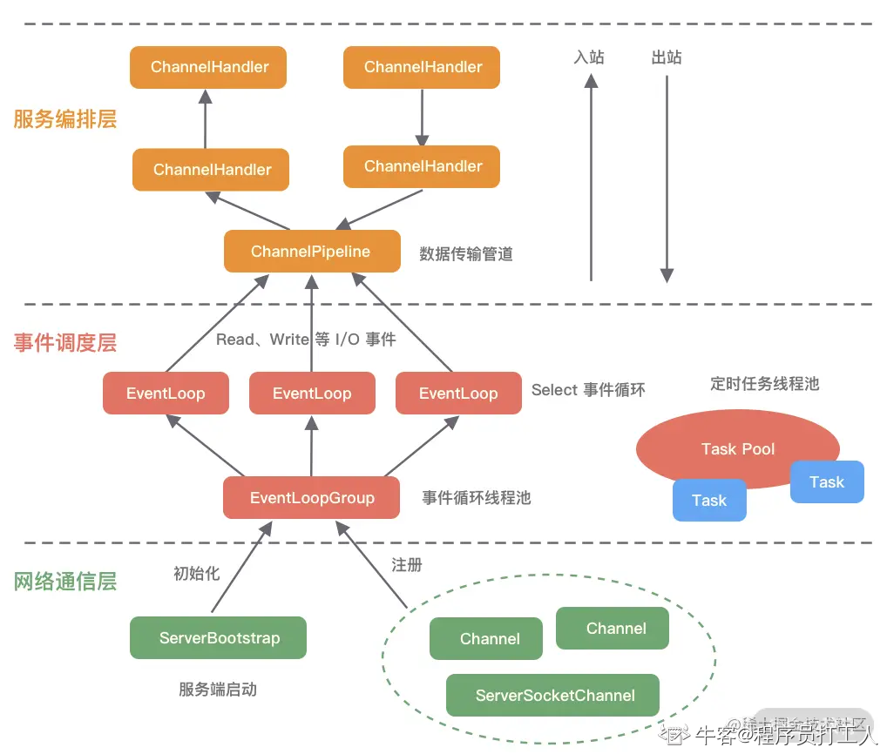
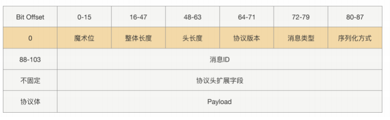

**不错的参考资料：**[聊聊Netty那些事儿之从内核角度看IO模型 (qq.com)](https://mp.weixin.qq.com/s/zAh1yD5IfwuoYdrZ1tGf5Q)

## IO模型

### BIO模型

服务阻塞点①： ServerSocket通过调用 accept( )方法，阻塞并返回一个 java.net.Socket 对象。只有当前客户端写完数据close后，服务端才会对下一个客户端进行处理。 

服务阻塞点②：BufferedReader#readLine方法是阻塞的，读取一行时只有碰到换行、回车、buffer溢出或者是客户端线程直接close关闭资源，最终才会返回null。 如果直接使用InputStream#read方法也会一直阻塞等待，除非客户端发来消息。

### NIO模型

Selector.select()：阻塞直到至少有一个通道在已注册的事件上就绪(设置为非阻塞的方式①可以指定阻塞时间，超过后不管是否就绪直接返回②通过wakeup方法直接唤醒selector)。

服务端单线程通过选择器Selector监测处理Channel多个通道，监听四种事件：连接就绪(客户端事件)、接受就绪(服务端)、读就绪(服务端读取客户端通道发送数据)、写就绪。每次事件读取完成后，都需要把事件剔除，防止下次重复读取事件。

ServerSocketChannel ：服务端通道，监听的作用。调用 accept( )监听客户端连接的通道(非阻塞模式，accept拿不到连接则返回null)。 

SocketChannel ：用于客户端与服务端之间相互读写数据。

#### Java NIO中的三大组件

Buffer、Channel、Selector

**Buffer**

一个 Buffer 本质上是内存中的一块，我们可以将数据写入这块内存，之后从这块内存获取数据。

Java中定义了几个Buffer的实现，用的最多的就是ByteBuffer。

Buffer有几个参数：capacity、limit、position

在写操作下，每往里边添加一个字符，position就+1，limit=capacity

在读操作下，则position从0开始记，limit则代表写入的长度。

**Channel**

所有的 NIO 操作始于通道，通道是数据来源或数据写入的目的地，Java NIO中提供了4种通道，分别是FileChannel(文件通道)、DataGramChannel（用于UDP连接）、SocketChannel（TCP客户端连接）、ServerSocketChannel（TCP服务端，用于监听某个端口传进来的请求）。

类似 IO 中的流，用于读取和写入，读操作的时候将 Channel 中的数据填充到 Buffer 中，而写操作时将 Buffer 中的数据写入到 Channel 中。

**Selector**

多路复用实现的方法，在Java NIO中，一般涉及到

1. 开启Selector。
2. 将Channel注册到Selector中，注册的参数有4种二进制方式，有通道可以读取，可以往通道写入数据，成功建立TCP连接，接受TCP连接。我们可以同时监听一个 Channel 中的发生的多个事件，比如我们要监听 ACCEPT 和 READ 事件，那么指定参数为二进制的 000**1**000**1** 即十进制数值 17 即可。

​	3. 调用 select() 方法获取通道信息。用于判断是否有我们感兴趣的事件已经发生了。

[Netty系列教程（二）Netty架构设计剖析 - 知乎 (zhihu.com)](https://zhuanlan.zhihu.com/p/536334873)

[无内鬼，来点netty面经_牛客网 (nowcoder.com)](https://www.nowcoder.com/feed/main/detail/6a98b67439d246f7a142831484d4f1c7?sourceSSR=search)

## Netty 的整体脉络

文章来源：[02 纵览全局：把握 Netty 整体架构脉络.md (lianglianglee.com)](https://learn.lianglianglee.com/专栏/Netty 核心原理剖析与 RPC 实践-完/02  纵览全局：把握 Netty 整体架构脉络.md)

一、网络通信层的核心组件包含有 BootStrap、ServerBootStrap、Channel三个组件。

**BootStrap  &  ServerBootStrap:**

Bootstrap 是“引导”的意思，它主要负责整个 Netty 程序的启动、初始化、服务器连接等过程，它相当于一条主线，串联了 Netty 的其他核心组件。

BootStrap 是用于引导客户端的。   ServerBootStrap是用于服务端的

两者非常重要的区别在于 Bootstrap 可用于连接远端服务器，只绑定一个 EventLoopGroup。而 ServerBootStrap 则用于服务端启动绑定本地端口，会绑定两个 EventLoopGroup，这两个 EventLoopGroup 通常称为 Boss 和 Worker。每个EventLoopGroup服务器中都会有一个 Boss，也会有一群做事情的 Worker。Boss 会不停地接收新的连接，然后将连接分配给一个个 Worker 处理连接。

**Chaneel**

Channel 是网络通信的载体，提供了与底层 Socket 交互的能力

Channel的状态和对应的事件要记住：

1. channelRegistered
2. channelActive
3. channelRead
4. channelReadComplete

二、事件调度层的核心组件包含有 **EventLoopGroup、EventLoop**

EventLoopGroup 本质是一个线程池，主要负责接收 I/O 请求，并分配线程执行处理请求。

EventLoopGroup、EventLoop和Channel的关系：   

1. EventLoopGroup中管理着大量的EventLoop，EventLoop 同一时间会与一个线程绑定，每个 EventLoop 负责处理多个 Channel。
2. 每新建一个 Channel，EventLoopGroup 会选择一个 EventLoop 与其绑定。该 Channel 在生命周期内都可以对 EventLoop 进行多次绑定和解绑。

EventLoopGroup 是 Netty Reactor 线程模型的具体实现方式，Netty 通过创建不同的 EventLoopGroup 参数配置，就可以支持 Reactor 的三种线程模型：

1. **单线程模型**：EventLoopGroup 只包含一个 EventLoop，Boss 和 Worker 使用同一个EventLoopGroup；
2. **多线程模型**：EventLoopGroup 包含多个 EventLoop，Boss 和 Worker 使用同一个EventLoopGroup；
3. **主从多线程模型**：EventLoopGroup 包含多个 EventLoop，Boss 是主 Reactor，Worker 是从 Reactor，它们分别使用不同的 EventLoopGroup，主 Reactor 负责新的网络连接 Channel 创建，然后把 Channel 注册到从 Reactor。

三、服务编排层

服务编排层的**核心组件**包括 **ChannelPipeline**、**ChannelHandler、ChannelHandlerContext**。

- ChannelPipeline线程安全

  **ChannelPipeline** 是线程安全的，因为每一个新的 Channel 都会对应绑定一个新的 ChannelPipeline。一个 ChannelPipeline 关联一个 EventLoop，一个 EventLoop 仅会绑定一个线程。

  负责组装各种 ChannelHandler，实际数据的编解码以及加工处理操作都是由 ChannelHandler 完成的。

  当 I/O 读写事件触发时，ChannelPipeline 会依次调用 ChannelHandler 列表对 Channel 的数据进行拦截和处理。因为每一个新的 Channel 都会对应绑定一个新的 ChannelPipeline。一个 ChannelPipeline 关联一个 EventLoop，一个 EventLoop 仅会绑定一个线程。

  数据入站会由一系列InBoundHandler处理，然后再以相反方向的OutBoundHandler处理后完成出站。

- ChannelHandler & ChannelHandlerContext
  Channel 与 ChannelPipeline 的关系是每创建一个Channel会绑定一个新的ChannelPipeline，每个ChannelPipeline中每加入一个ChannelHandler 都会绑定一个 ChannelHandlerContext。

- ChannelHandlerContext 包含了 ChannelHandler 生命周期的所有事件，如 connect、bind、read、flush、write、close

## Netty的高性能和高可靠体现在哪里？

### 高性能

1. I/O模型：Netty使用的I/O模型是NioEventLoop，它符合了多路复用器selector，可以同时处理成百上千个客户端连接。
2. 线程模型：Netty主要基于主从Reactor多线程模型来实现其线程模型，主Reactor主要负责客户端的连接请求，并将请求转发给从Reactor；从Reactor主要负责响应通道的IO读写请求。
3. 内存优化：TCP接收和发送缓冲区使用直接内存代替堆内存，避免了内存复制，避免了GC带来的性能开销，提升了IO读取和写入的性能。
4. 多线程优化：采用环形数组缓冲区实现无锁化并发编程，代替传统的线程安全容器或者锁。并且关键资源的处理使用 单线程串行化方式，避免多线程并发访问带来的锁竞争和额外的CPU资源消耗问题。

Netty实现高性能的原因：

- 非阻塞I/O模型
- 良好的线程模型设计
- 高效序列化协议支持
- 其他：零拷贝、内存池、无锁化减少线程切换开销、高效并发编程等。

**1. 零拷贝**

Netty的零拷贝体现在三个方面：

- Netty的接收和发送ByteBuf采用DIRECT BUFFERS，使用堆外内存进行socket读写，不需要进行自己缓冲区的二次拷贝。
- Netty提供了组合Buffer对象，可以聚合多个ByteBuffer对象，用户可以像操作一个Buffer那样方便的对组合Buffer进行操作，避免了传统通过内存拷贝的方式将几个小Buffer合并成一个大的Buffer。
- Netty的文件传输采用了transfer()方法，它可以直接将文件缓冲区的数据发送到目标Channel，避免了传统通过循环write发送导致的内存拷贝问题。

**2. 内存池**

由于ByteBuf分配的是堆外内存空间，其分配和回收过程不像JAVA实例内存分配和回收那么简单，为了尽量重用缓冲区，Netty提供了基于内存池的缓冲区重用机制。

基于内存池重用的ByteBuf性能比普通的ByteBuf高几十个数量级。

**3. 无锁化串行设计**

为了尽可能提升性能，Netty采用了串行无锁化设计，在I/O线程内部进行串行操作，避免多线程竞争导致的性能下降。表面上看，串行化设计似乎CPU利用率不高，并发程度不够。但是，通过调整NIO线程池的线程参数，可以同时启动多个串行化的线程并行运行，这种局部无锁化的串行线程设计相比一个队列-多个工作线程模型性能更优。

**4. 高效并发编程**

包括：

- volatile关键字的大量、正确使用
- CAS和原子类的广泛使用
- 线程安全容器的使用
- 通过读写锁提升并发性能

### 高可靠性

1. 链路有效性检测：心跳机制周期性地进行链路检测，Netty中支持三种链路空闲检测机制：
   - 读空闲超时机制。
   - 写空闲超时机制。
   - 读写空闲超时机制。
2. 内存保护机制
   - 通过内存池来重用ByteBuffer，节省内存。
   - 通过对象引用计数器对Netty的ByteBuffer等内置对象进行细粒度的内存申请和释放，对非法的对象引用进行检测和保护。
   - 可设置的内存容量上限，包括ByteBuf、线程池线程数等。
3. 优雅停机：Netty在所有涉及到资源回收和释放的地方都增加了优雅退出的方法

### 高扩展性

1. Netty很多的API提供了大量的扩展点，方便用户扩展自定义的逻辑处理：

   - 责任链模式：ChannelPipeline基于责任链模式开发，便于业务逻辑拦截定制扩展。
   - 基于接口的开发：关键的类库都提供了接口或者抽象类，如果Netty自身的实现无法满足需求，可以自定义实现相关接口。
   - 提供了大量的工厂模式：
   - 提供了大量的系统参数供用户按需设置， 增强系统的场景定制能力。

2. 多种协议支持：

   

## Netty中粘包问题

参考文献：[06 粘包拆包问题：如何获取一个完整的网络包？.md (lianglianglee.com)](https://learn.lianglianglee.com/专栏/Netty 核心原理剖析与 RPC 实践-完/06  粘包拆包问题：如何获取一个完整的网络包？.md)

**为什么会出现粘包？**

TCP 传输协议是面向流的，没有数据包界限。客户端向服务端发送数据时，可能将一个完整的报文拆分成多个小报文进行发送，也可能将多个报文合并成一个大的报文进行发送。因此就有了拆包和粘包。

为什么会出现拆包/粘包现象呢？在网络通信的过程中，每次可以发送的数据包大小是受多种因素限制的。这里边就涉及到MTU传输单元大小、MSS最大分段大小和滑动窗口。

MTU：链路层最大传输大小，一般是1500比特左右。   

MSS是TCP最大报文段：   MSS = MTU  - MAC 首部 - IP首部 - TCP首部

因此当  MAC 首部 + IP首部 + TCP首部 + MSS  > MTU的时候，就需要拆包

滑动窗口就是限制发送方每次发送数据的大小。

**解决方法：**

这也是解决拆包/粘包的唯一方法：**定义应用层的通信协议**

消息头 + 消息内容 ： 例如使用 4 字节的 int 值记录消息的长度，消息体实际的二进制的字节数据

接收方在解析数据时，首先读取消息头的长度字段 Len，然后紧接着读取长度为 Len 的字节数据，该数据即判定为一个完整的数据报文。

# Netty

`Netty`是一个异步的、基于事件驱动的网络应用框架，用以快速开发高性能、高可靠性的网络`IO`程序。 主要针对在`TCP`协议下，面向`Client`端的高并发应用，或者`Peer-to-Peer`场景下的大量数据持续传输的应用。`Netty`本质是一个`NIO`框架，适用于服务器通讯相关的多种应用场景。

1. 异步的
2. 事件驱动的
3. 针对TCP协议下，面向Client的
4. 或者是peer2peer的大量数据持续传输的应用
5. NIO框架

需要掌握的：

1. Netty的流程和各个组件是如何进行工作的。
2. Netty高效的原因
   - Reactor线程模型
   - 内存管理
   - 零拷贝
3. 如何自定义协议通信

## 原生Java NIO存在的问题

1. 原有的NIO库很复杂，开展使用很不方便。
2. 需要使用者自己去写一个工具包，开发难度很大。比如说粘包处理、断连重连，失败缓存，网络拥塞。
3. `JDK NIO`的`Bug`：例如臭名昭著的`Epoll Bug`，它会导致`Selector`空轮询，最终导致`CPU100%`。

## Netty模型

Netty基于Reactor多线程模型进行了一定的改进，其中主从Reactor中都有多个Reactor，可以大幅提高Netty的吞吐量。

1. 增加了BossGroup来维护多个主Reactor，主Reactor还是只关注连接的Accept；增加了WorkGroup来维护多个从Reactor，从Reactor将接收到的请求交给Handler进行处理。
2. 在主Reactor中接收到Accept事件，获取到对应的SocketChannel，Netty会将它进一步封装成NIOSocketChannel对象，，这个对象里边包含有所对象的信息。
3. 之后Netty就会将这个封装后的对象注册到WorkerGroup中的从Reactor中。
4. 当WorkerGroup中的从Reactor监听到事件后，就会将之交给与此Reactor对应的Handler进行处理。

### Netty速度为什么那么快？

1. 主从Reactor线程模型。利用多线程的优势实现了并发处理
2. Nio多路复用非阻塞。Netty使用Java的NIO（Non-blocking I/O）机制，基于Selector实现了多路复用的非阻塞I/O操作。
3. 无锁串行化思想：Netty的设计中尽可能避免了锁的使用，采用了无锁的数据结构和并发设计思想，减少了锁竞争和[线程阻塞](https://www.zhihu.com/search?q=线程阻塞&search_source=Entity&hybrid_search_source=Entity&hybrid_search_extra={"sourceType"%3A"answer"%2C"sourceId"%3A3050356925})，提高了并发性能和可伸缩性。在Netty中，即消息的处理尽可能在同一个线程内完成，期间不进行线程切换，这样就避免了多线程竞争和同步锁。
4. 支持高性能序列化协议。Netty支持Google的 Protobuf
5. 零拷贝：Netty通过使用直接内存（Direct Memory）实现了零拷贝的特性。它通过将数据直接从操作系统的内存缓冲区传输到网络中。
6. ByteBuf内存池设计：Netty使用了可配置的ByteBuf内存池，避免了频繁的内存分配和释放操作，减少了内存管理的开销，提高了内存的使用效率和性能。
7. 并发：Netty在设计上考虑了并发操作的优化。它采用了基于事件驱动的异步编程模型，通过回调和Future等机制实现非阻塞的并发处理。
8. 引入了一个类似于jemalloc的内存池管理技术。

### 具体流程

1. Netty会抽象出2个线程池，BossGroup专门用来接收客户端的连接，WorkerGroup专门负责网络的读写。
2. BossGroup和WorkerGroup的类型都是NioEventLoopGroup类型。
3. NioEventLoop相当于一个事件循环组，这个组里边包含有多个事件循环，每个事件循环都是NioEventLoop。
4. 每个NioEventLoop相当于是一个不断循环处理任务的线程，每个NioEventLoop都有一个selector。
5. 每个BossNioEventLoop循环三件事
   - 轮询Accept事件
   - 处理Accept事件，与cilent建立连接，生成NioSocketChannel，并将其注册到某个worker的NioEventLoop的selector上。
   - 处理任务队列
6. 每个Worker NioEventLoop循环三件事：
   - 轮询 NioSocketChannel是否有read，write事件。
   - 处理事件
   - 处理任务队列中的任务。
7. 在Worker NioEventLoop处理业务的时候，会使用pipeline，pipeline中存在有多个ChannelHandler，每个ChannelHandler都保存了这个ChannelHandlerContext的所有上下文信息。

### 对应关系

1. `Netty`抽象出两组线程池，`BossGroup`专门负责接收客户端连接，`WorkerGroup`专门负责网络读写操作。
2. `NioEventLoop`表示一个不断循环执行处理任务的线程，每个`NioEventLoop`都有一个`Selector`，用于监听绑定在其上的`socket`网络通道。
3. `NioEventLoop`内部采用串行化设计，从消息的**读取->解码->处理->编码->发送**，始终由`IO`线程`NioEventLoop`负责

NioEventLoopGroup`下包含多个`NioEventLoop

- 每个`NioEventLoop`中包含有一个`Selector`，一个`taskQueue`
- 每个`NioEventLoop`的`Selector`上可以注册监听多个`NioChannel`
- 每个`NioChannel`只会绑定在唯一的`NioEventLoop`上
- 每个`NioChannel`都绑定有一个自己的`ChannelPipeline`

## 异步模型

Netty`中的`I/O`操作是异步的，包括`Bind、Write、Connect`等操作会简单的返回一个`ChannelFuture。

调用者并不能立刻获得结果，实际Netty是使用了Future-listener机制，用户可以方便的主动获取或者通过通知机制获得`IO`操作结果。

## 主要组件

### Bootstrap，ServerBootStrap

一个`Netty`应用通常由一个`Bootstrap`开始，主要作用是配置整个`Netty`程序，串联各个组件，`Netty`中`Bootstrap`类是客户端程序的启动引导类，`ServerBootstrap`是服务端启动引导类。

### Future、ChannelFuture

`Netty`中所有的`IO`操作都是异步的，不能立刻得知消息是否被正确处理。但是可以过一会等它执行完成或者直接注册一个监听，具体的实现就是通过`Future`和`ChannelFutures`，他们可以注册一个监听，当操作执行成功或失败时监听会自动触发注册的监听事件

### Channel

1. `Netty`网络通信的组件，能够用于执行网络`I/O`操作。
2. `Channel`提供异步的网络`I/O`操作(如建立连接，读写，绑定端口)，异步调用意味着任何`I/O`调用都将立即返回，并且不保证在调用结束时所请求的`I/O`操作已完成。
3. 调用立即返回一个`ChannelFuture`实例，通过注册监听器到`ChannelFuture`上，可以`I/O`操作成功、失败或取消时回调通知调用方。

### Selector

1. `Netty`基于`Selector`对象实现`I/O`多路复用，通过`Selector`一个线程可以监听多个连接的`Channel`事件。
2. 当向一个`Selector`中注册`Channel`后，`Selector`内部的机制就可以自动不断地查询(`Select`)这些注册的`Channel`是否有已就绪的`I/O`事件(例如可读，可写，网络连接完成等)，这样程序就可以很简单地使用一个线程高效地管理多个`Channel`

### ChannelHandler

1. `ChannelHandler`是一个接口，处理`I/O`事件或拦截`I/O`操作，并将其转发到其`ChannelPipeline`(业务处理链)中的下一个处理程序。
2. 我们经常需要自定义一个`Handler`类去继承`ChannelInboundHandlerAdapter`，然后通过重写相应方法实现业务逻辑。

### Pipeline和ChannelPipeline

1. ChannelPipeline是一个Handler的集合，它负责处理和拦截`inbound`或者`outbound`的事件和操作，相当于一个贯穿`Netty`的链。
2. `hannelPipeline`实现了一种高级形式的拦截过滤器模式，使用户可以完全控制事件的处理方式，以及`Channel`中各个的`ChannelHandler`如何相互交互
3. 在`Netty`中每个`Channel`都有且仅有一个`ChannelPipeline`与之对应

### ChannelHandlerContext

1. 保存`Channel`相关的所有上下文信息，同时关联一个`ChannelHandler`对象
2. 即`ChannelHandlerContext`中包含一个具体的事件处理器`ChannelHandler`，同时`ChannelHandlerContext`中也绑定了对应的`pipeline`和`Channel`的信息，方便对`ChannelHandler`进行调用。

### EventLoopGroup、EventLoop、NioEventLoopGroup

1. EventLoopGroup管理着多个EventLoop，每个EventLoop维护着一个Selector实例。
2. 常一个服务端口即一个`ServerSocketChannel`对应一个`Selector`和一个`EventLoop`线程。`BossEventLoop`负责接收客户端的连接并将`SocketChannel`交给`WorkerEventLoopGroup`来进行`IO`处理

### 编解码器

**编码器：** 将数据转化为二进制

**解码器：** 将二进制转化为数据

`Netty`的组件设计：`Netty`的主要组件有`Channel`、`EventLoop`、`ChannelFuture`、`ChannelHandler`、`ChannelPipe`等

`ChannelHandler`可以充当入站和出站数据的应用程序逻辑的容器，例如，实现ChannelInboundHandler接口或ChannelOutBoundHandler接口，就可以接收入站事件和数据，这些数据会被业务逻辑处理。

1. 当`Netty`发送或者接受一个消息的时候，就将会发生一次数据转换。入站消息会被解码：从字节转换为另一种格式(比如`java`对象)；如果是出站消息，它会被编码成字节。
2. Netty提供了一系列实用的编解码器看，全都实现了ChannelInboundHandler或者是ChannelOutboundHandler接口。

**常见的编码器有**ByteToMessageDecoder

**常见的解码器有**ReplayingDecoder

在我们的Gateway网关中，所使用的是`HttpObjectDecoder`：一个`HTTP`数据的解码器，和`HttpObjectEncoder`：一个Http数据的编码器

## ByteBuf

java中的ByteBuffer存在有几点问题

1. 无法动态扩容
2. ByteBuffer 只能通过 position 获取当前可操作的位置，因为读写共用了同一个指针。

为此，Netty重新设计了一个ByteBuf，功能有：

1. 可以动态扩容。
2. 读写采用了不同的指针，读写模式可以随意切换。
3. 支持引用计数；
4. 支持缓存池。

其中一个很重要的点就是，当我们创建一个byteBuf的时候，初始引用计数为1，当我们调用release的时候，则是-1。

引用计数对于 Netty 设计缓存池化有非常大的帮助，当引用计数为 0，该 ByteBuf 可以被放入到对象池中，避免每次使用 ByteBuf 都重复创建，对于实现高性能的内存管理有着很大的意义。

### 内存池管理计数（实际参考于内存分配管理器 Jemalloc）

它的思想是：

1. 分四种内存规格管理内存，分别为 Tiny、Samll、Normal、Huge，PoolChunk 负责管理 8K 以上的内存分配，PoolSubpage 用于管理 8K 以下的内存分配。当申请内存大于 16M 时，不会经过内存池，直接分配。
2. 设计了本地线程缓存机制 PoolThreadCache，用于提升内存分配时的并发性能。用于申请 Tiny、Samll、Normal 三种类型的内存时，会优先尝试从 PoolThreadCache 中分配。
3. PoolChunk 使用伙伴算法管理 Page，以二叉树的数据结构实现，是整个内存池分配的核心所在。
4. 每调用 PoolThreadCache 的 allocate() 方法到一定次数，会触发检查 PoolThreadCache 中缓存的使用频率，使用频率较低的内存块会被释放。
5. 线程退出时，Netty 会回收该线程对应的所有内存。

## 零拷贝

所谓零拷贝，就是在数据操作时，不需要将数据从一个内存位置拷贝到另外一个内存位置，这样可以减少一次内存拷贝的损耗，从而节省了 CPU [时钟周期](https://so.csdn.net/so/search?q=时钟周期&spm=1001.2101.3001.7020)和内存带宽。

1. 堆外内存，避免 JVM 堆内存到堆外内存的数据拷贝。
2. CompositeByteBuf 类，可以组合多个 Buffer 对象合并成一个逻辑上的对象，避免通过传统内存拷贝的方式将几个 Buffer 合并成一个大的 Buffer。
3. 通过 Unpooled.wrappedBuffer 可以将 byte 数组包装成 ByteBuf 对象，包装过程中不会产生内存拷贝。
4. ByteBuf支持slice方法可以将ByteBuf分解成多个共享内存区域的ByteBuf,避免了内存拷贝。
5. Netty 使用 FileRegion 实现文件传输，FileRegion 底层封装了 FileChannel#transferTo() 方法，也就是操作系统的sendfile()函数，可以将文件缓冲区的数据直接传输到目标 Channel，避免内核缓冲区和用户态缓冲区之间的数据拷贝，这属于操作系统级别的零拷贝。

### 堆外内存

Netty是直接使用堆外内存进行I/O处理的，可以避免数据从 JVM 堆内存到堆外内存的拷贝。

### ComposityByteBuf数据结构

CompositeByteBuf 可以理解为一个虚拟的 Buffer 对象，它是由多个 ByteBuf 组合而成，但是在 CompositeByteBuf 内部保存着每个 ByteBuf 的引用关系，从逻辑上构成一个整体。

正常情况下，如果我们有两个byteBuf，分别是header和body，我们首先要初始化一个新的buf，然后再将header和body拷贝进来，合并过程中涉及两次 CPU 拷贝，这非常浪费性能。

但是对于CompositeByteBuf而言，底层的 byte 数组是复用的，不会发生内存拷贝。但对于用户来说，它可以当作一个整体进行操作。

### Unpooled.wrappedBuffer

Unpooled.wrappedBuffer 方法可以将不同的数据源的一个或者多个数据包装成一个大的 ByteBuf 对象，其中数据源的类型包括 byte[]、ByteBuf、ByteBuffer。包装的过程中不会发生数据拷贝操作，包装后生成的 ByteBuf 对象和原始 ByteBuf 对象是共享底层的 byte 数组。

## 自定义协议

### 协议的作用

只有二进制才能在网络中传输，所以RPC请求在发送到网络之前，需要把方法调用的请求参数转成二进制。

而且RPC不会把所有的请求参数一下子都传到对端机器上，中间可能会拆分数据或合并其他请求的数据。

而协议相当于给文章添加标点符号，为了对传输的二进制数据进行划分，避免语义不一致的情况发生，在发送请求的时候设定一个边 界，然后在收到请求的时候按照这个设定的边界进行数据分割。**这个边界语义的表达，就是我们所说的协议。**

### 如何设计协议

为什么不用现成的HTTP协议，而需要自己设计？ 

相对于 HTTP 的用处，RPC 更多的是负责应用间的通信，所以性能要求相对更高。 

1. HTTP 协议的数据包大小相对请求数据本身要大很多，又需要加入很多无用的内容，比如换行符号、回车符等。
2. HTTP 协议属于无状态协议，客户端无法对请求和响应进行关联，每次请求都需要重新建立连接，响应完成后再关闭连接。

#### 设计定长协议

1. 协议头：用于存放固定长度的参数 
   - 序列化方式 
   - 消息类型 
   - 消息ID 
   - 协议版本 
   -  .... 

2. 协议体：只存放请求接口方法，参数等

#### 不定长协议

定长协议头协议的缺点就是无法升级，即以后不能再往协议头里加新参数，所以需要设计一种支持可扩展的协议，关键就是让协议头支持 可扩展，扩展后协议头的长度就不能定长了，那要实现读取不定长的协议头里面的内容，在这之前肯定需要一个固定的地方读取长度，所 以我们需要一个固定的写入协议头的长度。整体协议就变成了三部分内容：固定部分、协议头内容、协议体内容。

## Netty的序列化协议

选择一个序列化协议所需要考虑的：

1. 序列化空间开销，也就是序列化产生的结果大小，这个影响到传输的性能
2. 序列化过程中消耗的时长，序列化消耗时间过长影响到业务的响应时间
3. 序列化协议是否支持跨平台，跨语言。因为现在的架构更加灵活，如果存在异构系统通信需求，那么这个是必须要考虑的
4. 可扩展性/兼容性，在实际业务开发中，系统往往需要随着需求的快速迭代来实现快速更新，这就要求我们采用的序列化协议基于良好的可扩展性/兼容性，比如在现有的序列化数据结构中新增一个业务字段，不会影响到现有的服务
5. 技术的流行程度，越流行的技术意味着使用的公司多，那么很多坑都已经淌过并且得到了解决，技术解决方案也相对成熟
6. 学习难度和易用性

序列化协议，所谓的高效，通常应该从两方面考虑：

1. 序列化后的二进制序列大小。
2. 序列化、反序列化的速率。

影响序列化性能的关键因素总结如下：

- 序列化后的码流大小（网络带宽的占用）；
- 序列化&反序列化的性能（CPU资源占用）；
- 是否支持跨语言（异构系统的对接和开发语言切换）。

采用什么样的通信协议，对系统的性能极其重要，netty默认提供了对Google Protobuf的支持，也可以通过扩展Netty的编解码接口，用户可以实现其它的高性能。

### JDK自带的序列化

不使用的原因：

1. 不支持跨语言调用。
2. 性能差。主要原因是序列化之后的字节数组体积较大，导致传输成本加大。
3. 存在安全问题。当输入的反序列化的数据可被用户控制，那么攻击者即可通过构造恶意输入，让反序列化产生非预期的对象，在此过程中执行构造的任意代码。

### Kryo

- 不是线程安全的，要通过ThreadLocal或者创建Kryo线程池来保证线程安全。对象池 + Kryo 解决线程不安全，也可以使用ThreadLocal + Kryo 解决线程不安全
- 使用变长的int和long保证这种基本数据类型序列化后尽量小
- 需要传入完整类名或者利用 register() 提前将类注册到Kryo上，其类与一个int型的ID相关联，序列中只存放这个ID，因此序列体积就更小

Kryo序列化的原理是将Java对象转换成字节流，使用高效的算法将其压缩，最终输出一个字节数组。具体实现过程如下：

1、寻找字段的声明类型及其它相关信息。

2、序列化类型名。

3、序列化对象的实际信息。

4、递归序列化。

5、使用动态ClassLoaders来处理类的加载问题。

Kryo 支持以下的类型：

- 枚举
- 集合、数组
- 子类 / 多态
- 循环引用
- 内部类
- 泛型

### Protobuf

Protobuf使用比较广泛，主要是空间开销小和性能比较好，非常适合用于公司内部对性能要求高的RPC调用。 另外由于解析性能比较高，序列化以后数据量相对较少，所以也可以应用在对象的持久化场景中。

为什么序列化那么好，是因为它使用了两个压缩算法：一种是varint，另一种是zigzag。同时数据存储方式，采用T - L - V 的数据存储方式：减少了分隔符的使用 & 数据存储得紧凑。

### Protostuff

Google的protobuf因为其编码后体积小，序列化／反序列化性能好，被广泛使用。但是protobuf需要编写.proto文件，再通过protobuf转换成对应的java代码，非常不好维护。

protostuff就是为了解决这个痛点而产生的。通过protostuff，不需要编写.proto文件，只需要编写普通的java bean就可以使用protobuf的序列化／反序列化。

### fastjson

1. JSON 进行序列化的额外空间开销比较大，对于大数据量服务这意味着需要巨大的内存和磁盘开销；

2. JSON 没有类型，但像 Java 这种强类型语言，需要通过反射统一解决，所以性能不会太好（比如反序列化时先反序列化为String类，要自己通过反射还原）。

### 造成这些序列化协议的（序列化和反序列化）时间开销和（序列化之后的）体积大小的关键是什么？你可以比较两个你认为在性能和体积上有差异的序列化协议，然后说明一下产生这个差异的原因吗？ 

序列化协议的时间开销和体积大小的关键是协议的设计和实现方式。一些协议可能要求在序列化和反序列化期间执行大量的计算和IO操作，因此需要更长的时间开销。同样，一些协议可能生成的字节序列更大，因此需要更长的传输时间和更多的存储空间。

例如，比较JSON和Protocol Buffers (protobuf)两种序列化协议。protobuf通常比JSON性能更好，因为protobuf使用了二进制编码，可以更紧凑的存储数据，同时protobuf定义了数据的结构和类型，因此可以跳过类型转换和解析的步骤，从而提高了序列化和反序列化的速度。与此相比，JSON是一种文本协议，通过键值对的格式存储数据，其密度较低，因此相对于protobuf产生了更大的数据量。另外，JSON需要更多的类型转换和解析过程，这也需要更多的时间。

总之，序列化协议的性能和体积大小是设计和实现方式的结果，根据具体的使用场景和需求选择最合适的协议来满足需求。

## 利用 Netty 实现自定义协议通信

文章参考：[07 接头暗语：如何利用 Netty 实现自定义协议通信？.md (lianglianglee.com)](https://learn.lianglianglee.com/专栏/Netty 核心原理剖析与 RPC 实践-完/07  接头暗语：如何利用 Netty 实现自定义协议通信？.md)

为什么要设计一个自定义协议通信：

1. **极致的性能：**通用的通信协议考虑了很多兼容性的因素，必然在性能方面有所损失。
2. **扩展性**：自定义的协议相比通用协议更好扩展，可以更好地满足自己的业务需求。
3. **安全性**：通用协议是公开的，很多漏洞已经很多被黑客攻破。自定义协议更加**安全**，因为黑客需要先破解你的协议内容。

制作一个自定义协议通信需要的基本要素有哪些：

1. **魔数：**信双方协商的一个暗号，通常采用固定的几个字节表示。魔数的作用是**防止任何人随便向服务器的端口上发送数据**。
2. **协议版本号：** 随着业务需求的变化，协议可能需要对结构或字段进行改动。
3. **序列化算法：**应该采用何种方法将请求的对象转化为二进制，以及如何再将二进制转化为对象，如 JSON、Hessian、Java 自带序列化等。
4. **报文的类型：**在不同的业务场景中，报文可能存在不同的类型。例如在 RPC 框架中有请求、响应、心跳等类型的报文，在 IM 即时通信的场景中有登陆、创建群聊、发送消息、接收消息、退出群聊等类型的报文。
5. **状态：**用于标识当前请求是否正常。
6. **正文长度**

### Netty提供的编解码抽象类

Netty的编解码器分为一次编解码和二次编解码，一次编解码用于解决TCP拆包和粘包问题，解析得到字节数据，二次编解码主要解决的是对解析后的字节数据做对象转换，需要用到二次编解码。

**Netty解决粘包的方法就是**ByteToMessageDecoder类中包含decode()抽象方法，可以通过继承ByteToMessageDecoder并实现该方法完成自定义解码。decode()在调用时需要传入ByteBuf以及用来添加解码后消息的List列表。由于拆包/粘包问题，ByteBuf中可能包含多个有效报文，或者不够一个完整的报文，因此Netty会重复会调用decode()方法，直到解码出新的完整报文可以添加到List中，或者ByteBuf中没有更多可读的数据为止。如果List不为空，将会传递给下一个ChannelInboundHandler。

一般先使用ByteToMessageDecoder解析TCP协议，解决拆包/粘包问题，然后用MessageToMessageDecoder做数据对象的转换

