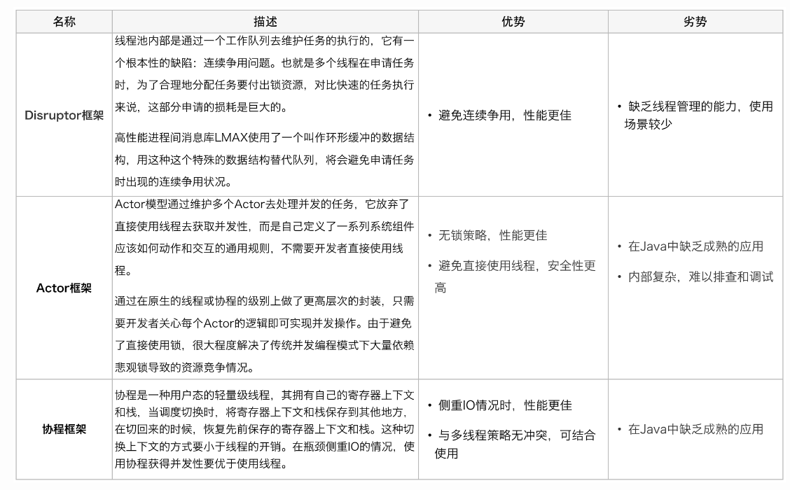

4、disruptor 不同等待策略；

5、为什么选择 disruptor；

6、介绍下 disruptor 的底层实现；

7、disruptor 的无锁体现在哪里；

8、disruptor 游标的技巧；

9、disruptor 如何解决 JDK 当时无法处理的伪共享；

5、介绍下 Disruptor，有哪些组件使用到了；

6、Disruptor 底层实现，为什么快；

3、disruptor 的使用场景；

3、介绍下 disruptor；

3、介绍下 disruptor；

7、介绍 disruptor 框架的特点；介绍下使用场景；

## Java中的队列

一共有18种队列，首先接口就是  `Queue、Deque、TransferQueue、BlockingQueue、BlockingDeque`

### BlockingQueue接口

应用场景：生产者和消费者，生产者线程向队列里添加元素，消费者线程从队列里移除元素，阻塞队列时获取和存放元素的容器。

**为什么要用阻塞队列**：生产者生产和消费者消费的速率不一样，需要用队列来解决速率差问题，当队列满了或空的时候，则需要阻塞生产或消费动作来解决队列满或空的问题

#### 实现了BlockingQueue接口的类：

比较特殊的是

`LinkedListBlockingQueue` ：由界链表阻塞队列

`ArraysListBlockingQueue`：由数组组成的阻塞队列

`SynchronousQueue:`不存储元素的阻塞队列

`LinkedTransferQueue:`由链表组成的无界阻塞队列

`DelayQueue:`优先级延迟无界队列

### DelayQueue类

在创建元素时，可以指定多久可以从队列中获取到当前元素。只有在延时期满才能从队列中获取到当前元素。

- 缓存系统的设计：可以用DelayQueue保存缓存元素的有效期。然后用一个线程循环的查询DelayQueue队列，一旦能从DelayQueue中获取元素时，表示缓存有效期到了。
- 定时任务调度：使用DelayQueue队列保存当天将会执行的任务和执行时间，一旦从DelayQueue中获取到任务就开始执行。比如Java中的TimerQueue就是使用DelayQueue实现的。

### SynchronousQueue类

只能存放一个数据

### TransferQueue接口

如果有消费者正在获取元素，则将队列中的元素传递给消费者。如果没有消费者，则等待消费者消费。即必须要完成任务才能返回。

### PriorityQueue类

按照优先级排序的队列，是一个支持优先级的无界阻塞队列。

### Java Queue存在的问题

- 基于数组线程安全的队列，比较典型的是ArrayBlockingQueue，它主要通过加锁的方式来保证线程安全；
- 基于链表的线程安全队列分成LinkedBlockingQueue和ConcurrentLinkedQueue两大类，前者也通过锁的方式来实现线程安全，而后者通过原子变量compare and swap（以下简称“CAS”）这种**无锁方式**来实现的。

但是，对 volatile类型的变量进行 CAS 操作，存在伪共享问题

### 伪共享问题

CPU的缓存系统是以缓存行(cache line)为单位存储的，一般的大小为64bytes。在多线程程序的执行过程中，存在着一种情况，多个需要频繁修改的变量存在同一个缓存行当中。

假设我现在用的是ArrayBlockingQueue，他有三个变量，一个是takeindex：需要被取走的元素下走，一个是PutIndex：可被元素插入的位置下标，一个是count：队列中元素的数量。然后有两个线程，线程A和线程B，分别保存着这三个值。这三个变量很容易放到一个缓存行中，但是之间修改没有太多的关联。所以每次修改，都会使之前缓存的数据失效，从而不能完全达到共享的效果。需要从主存中重新读取。

它的本质就是：**对缓存行中的单个变量进行修改了，导致整个缓存行其他不相关的数据也就失效了，需要从主存重新加载**

**解决方法：**减少伪共享也就意味着减少了`stall`的发生，其中一个手段就是通过填充(Padding)数据的形式，来保证本应有可能位于同一个缓存行的两个变量，在被多线程访问时必定位于不同的缓存行。也就是空间换时间，使用占位字节，将变量所在的缓冲行给塞满。

Java有一个注解就是专门这个功能，就是@contented，会自动进行缓存行填充。

## Disruptor

### Disruptor是什么？ 

Disruptor 是一个开源的高性能内存队列。Disruptor 提供的功能优点类似于 Kafka、RocketMQ 这类分布式队列，不过，其作为范围是 JVM(内存)。

它在无锁的情况下还能保证队列有界，并且还是线程安全的。

### Kafka 和 disruptor的区别是什么？

- **Kafka**：分布式消息队列，一般用在系统或者服务之间的消息传递，还可以被用作流式处理平台。
- **Disruptor**：内存级别的消息队列，一般用在系统内部中线程间的消息传递。

### Disruptor的等待策略都有哪些？

1. **BlockingWaitStrategy**：默认的策略，内部使用`ReentrantLock`和`condition`来控制线程的唤醒。这个是最低效的策略，但是对CPU消耗最小，更能够提供一致性效果。
2. **SleepingWaitStrategy**：性能表现跟 **BlockingWaitStrategy**一样，是另一种较为平衡CPU消耗与延迟的WaitStrategy在不同次数的重试后采用不同的策略选择继续尝试或者让出CPU或者sleep。这种策略延迟不均匀，但这种情况是对生产者最好。
3. **YieldingWaitStrategy**：YieldingWaitStrategy将自旋以等待序列增加到适当的值。在循环体内，将调用Thread.yield()以允许其他排队的线程运行。在要求极高性能且事件处理线数小于 CPU 逻辑核心数的场景中，推荐使用此策略。但这个策略不会带来显著的延迟抖动
4. **BusySpinWaitStrategy**：性能最好，适合用于低延迟的系统。在要求极高性能且事件处理线程数小于CPU逻辑核心数的场景中，推荐使用此策略；例如，CPU开启超线程的特性。

### 核心思想

- **环形数组：**由于这个数组中的所有元素在初始化时一次性全部创建，因此这些元素的内存地址一般来说是连续的。这样做的好处是，当生产者不断往 RingBuffer 中插入新的事件对象时，这些事件对象的内存地址就能够保持连续，从而利用 CPU 缓存的局部性原理，将相邻的事件对象一起加载到缓存中，提高程序的性能。还可以避免频繁的内存分配和垃圾回收
- **元素位置定位：**数组长度2^n，通过位运算，加快定位的速度。下标采取递增的形式。不用担心index溢出的问题。index是long类型，即使100万QPS的处理速度，也需要30万年才能用完。数组可以快速定位到所需元素，通常使用取模，在disruptor中使用位运算。环形数组内的元素不会被删除，只会被覆盖。
- **无锁设计：**每个生产者或者消费者线程，会先申请可以操作的元素在数组中的位置，申请到之后，直接在该位置写入或者读取数据，整个过程通过原子变量CAS，保证操作的线程安全，它是
- **避免了伪共享问题**：CPU 缓存内部是按照 Cache Line（缓存行）管理的，一般的 Cache Line 大小在 64 字节左右。Disruptor 为了确保目标字段独占一个 Cache Line，会在目标字段前后增加了 64 个字节的填充（前 56 个字节和后 8 个字节），这样可以避免 Cache Line 的伪共享（False Sharing）问题。

### Disruptor为什么那么快

#### 数据结构

Disruptor使用了一种环形缓冲区数组作为数据结构，并在启动时预先分配环形缓冲区。数组的连续多个元素会一并加载到 CPU Cache 里面来，所以访问遍历的速度会更快。

#### 垃圾回收

当对象的寿命很短或实际上是常驻的时候，垃圾收集器工作得最好。在环形缓冲区中预先分配 entry 意味着它对于垃圾收集器来说是常驻内存的，垃圾回收的负担就很轻。

#### 元素定位快

数组长度 2^n，通过位运算，加快定位的速度。下标采取递增的形式。不用担心 index 溢出的问题。index 是 long 类型，即使 100 万 QPS 的处理速度，也需要 30 万年才能用完。

#### 字符填充，解决伪共享问题

一般的 Cache Line 大小在 64 字节左右，然后 Disruptor 在非常重要的字段前后加了很多额外的无用字段。可以让这一个字段占满一整个缓存行，这样就可以避免未共享导致的误杀。

#### 无锁设计

在多个生产者的情况下，一般会遇到 **”如何防止多个线程重复写同一个元素**的问题，Disruptor给的方案是，个线程获取不同的一段数组空间进行操作。这个通过 CAS 很容易达到。只需要在分配元素的时候，通过 CAS 判断一下这段空间是否已经分配出去即可。

但如何防止读取的时候，读到还未写的元素。Disruptor 在多个生产者的情况下，引入了一个与 Ring Buffer 大小相同的 buffer，Available Buffer。当某个位置写入成功的时候，便把 Availble Buffer 相应的位置置位，标记为写入成功。读取的时候，会遍历 Available Buffer，来判断元素是否已经就绪。

### 使用场景

1. 经过测试，Disruptor的的延时和吞吐量都比ArrayBlockingQueue优秀很多，所以，当你在使用ArrayBlockingQueue出现性能瓶颈的时候，你就可以考虑采用Disruptor的代替。

2. Disruptor的最常用的场景就是“生产者-消费者”场景，对场景的就是“一个生产者、多个消费者”的场景，并且要求顺序处理。

   举个例子，我们从MySQL的BigLog文件中顺序读取数据，然后写入到ElasticSearch（搜索引擎）中。在这种场景下，BigLog要求一个文件一个生产者，那个是一个生产者。而写入到ElasticSearch，则严格要求顺序，否则会出现问题，所以通常意义上的多消费者线程无法解决该问题，如果通过加锁，则性能大打折扣

3. 停车场景。当汽车进入停车场时(A)，系统首先会记录汽车信息(B)。同时也会发送消息到其他系统处理相关业务(C)，最后发送短信通知车主收费开始(D)。在这个结构下，每个消费者拥有各自独立的事件序号Sequence，消费者之间不存在共享竞态。SequenceBarrier1监听RingBuffer的序号cursor，消费者B与C通过SequenceBarrier1等待可消费事件。SequenceBarrier2除了监听cursor，同时也监听B与C的序号Sequence，从而将最小的序号返回给消费者D，由此实现了D依赖B与C的逻辑。

### Disruptor在shenyu中的应用

[Soul网关-Disrutpor使用 - sewell_画风 - 博客园 (cnblogs.com)](https://www.cnblogs.com/sewell/p/15212221.html)

[apache-shenyu之Disruptor如何应用 - 简书 (jianshu.com)](https://www.jianshu.com/p/406d3272668e)
soul中，Disruptor在客户机接入时用来同步数据的，用以进行网关服务器数据的更新操作

[【战、面试官】java队列不行了？换成Disruptor吧！ - 知乎 (zhihu.com)](https://zhuanlan.zhihu.com/p/532482184)

[Disruptor实践 | BryantChang的博客](https://bryantchang.github.io/2019/01/15/disruptor/)

[(44条消息) disruptor笔记之五：事件消费实战_如何模拟事件并行消费_程序员欣宸的博客-CSDN博客](https://blog.csdn.net/boling_cavalry/article/details/117405835)

实战步骤

1. 定义一个事件（可以是泛型）
2. 定义一个事件工厂 继承 `EventFactory`
3. 定义事件处理函数 继承`EventHandler<事件>`，改写`onEvent`（消费者）
4. 定义事件方法，定义`onData`
5. 在主函数中设置
   - 创建`Ringbuffer`，将 RingBuffer 的创建方式改为支持多个生产者的模式。您可以使用 `RingBuffer.createMultiProducer()` 方法来创建支持多生产者的 RingBuffer。`BufferSize`设置为1024 * 1024， 阻塞策略为 `TieldingWaitStrategy`
   - 通过`ringBuffer` 创建一个屏障 `SequenceBarrier`
   - 继承`WorkHandler`设置5个线程。
   - 构建多消费者工作池
   - 设置多个消费者的sequence序号 用于单独统计消费进度, 并且设置到ringbuffer中
   - 启动workerPool，工作线程为5
6. 每当有消息来时，放入到disruptor中，然后mysql再取出来

1. Disruptor 的消费者数量：根据硬件的物理核心数，建议将 Disruptor 的消费者数量设置为4或略大于4。这样可以充分利用物理核心的性能，避免过多的线程上下文切换。
2. 线程池数量：对于线程池的数量，建议根据系统的具体情况和并发需求进行调整。如果您的系统并发量较大且每个任务的处理时间较长，可以适度增加线程池的数量以充分利用处理能力。通常，将线程池的大小设置为与消费者数量相等或略大于消费者数量是一个合理的起点。

综合考虑以上建议，您可以将 Disruptor 的消费者数量设置为4，并创建一个线程池，线程池的大小可以设置为4或略大于4，以匹配消费者的数量。

### 其他组件有用到disruptor

1. shenyu也使用了。
2. Log4j2：Log4j2 是一款常用的日志框架，它基于 Disruptor 来实现异步日志.SOFATracer：
3. SOFATracer 是蚂蚁金服开源的分布式应用链路追踪工具，它基于 Disruptor 来实现异步日志。
4. Storm : Storm 是一个开源的分布式实时计算系统，它基于 Disruptor 来实现工作进程内发生的消息传递（同一 Storm 节点上的线程间，无需网络通信）。
5. HBase：HBase 是一个分布式列存储数据库系统，它基于 Disruptor 来提高写并发性能。
